# Product Requirements Document (PRD) v0.1.2
## CrisisMesh - Offline Emergency Communication Network

**Document Version:** 0.1.2  
**Last Updated:** December 7, 2025  
**Product Version:** v0.1.1  
**Status:** Active Development

---

## 1. Executive Summary

### 1.1 Product Vision
CrisisMesh is a decentralized, offline-first emergency communication platform designed for disaster scenarios and low-connectivity environments. The system enables peer-to-peer messaging across local networks without requiring internet connectivity or centralized infrastructure, utilizing a mesh network topology with store-and-forward (Delay Tolerant Networking) capabilities.

### 1.2 Target Users
- **Primary (Commander View):** Emergency responders, disaster relief coordinators, military operators who need full mesh visibility and control via Terminal UI
- **Secondary (Civilian View):** Civilians, volunteers, community members who access the mesh via mobile-friendly Web UI
- **Tertiary:** Developers and researchers interested in mesh networking and DTN protocols

### 1.3 Core Value Proposition
- **Zero Infrastructure Dependency:** Functions without internet, cellular networks, or centralized servers
- **Self-Organizing:** Automatic peer discovery and mesh formation via UDP broadcast
- **Resilient:** Store-and-forward ensures message delivery even with intermittent connectivity
- **Emergency-First:** Panic Protocol (SOS + GPS) for critical situations with optional cloud relay
- **Dual Interface:** 
  - **Commander View (TUI):** Full-featured terminal dashboard with network monitoring, encryption status, and peer management
  - **Civilian View (Web UI):** Simplified mobile-friendly chat interface with SOS button and identity management

---

## 2. System Architecture

### 2.1 Technology Stack

#### Backend (Go)
- **Language:** Go 1.24.0+
- **Database:** SQLite with GORM ORM (WAL mode for concurrency)
- **Cryptography:** NaCl/Box (Curve25519, XSalsa20-Poly1305)
- **TUI Framework:** Bubble Tea with Lipgloss styling
- **CLI Framework:** Cobra
- **Networking:** Native Go `net` package (TCP/UDP)

#### Frontend (Web)
- **Architecture:** Vanilla JavaScript (no build tools, no frameworks)
- **Polling:** 1-second interval for message updates (no WebSockets)
- **Visualization:** vis-network for mesh topology graphs
- **Styling:** Custom CSS with cyberpunk/military aesthetic
- **Browser APIs:** Geolocation API with Tokyo-based simulation fallback

#### External Integration
- **Uplink Service:** Discord Webhooks for SOS cloud relay (optional)
- **QR Code Generation:** go-qrcode for mesh join URIs

### 2.2 System Architecture Diagram


### 2.3 Data Flow

#### Message Publishing Flow


#### Message Receiving Flow

```mermaid
sequenceDiagram
    participant Peer as Peer Node
    participant Conn as TCP Connection
    participant Handler as Packet Handler
    participant Engine as Gossip Engine
    participant DB as SQLite DB
    participant TUI as TUI Channel
    participant Uplink as Uplink Channel
    
    Peer->>Conn: Send packet bytes
    Conn->>Handler: ReadFrame (4-byte length + payload)
    Handler->>Handler: JSON Unmarshal → Packet
    
    alt Type: MSG
        Handler->>Engine: handleMsg(payload)
        
        alt IsEncrypted AND RecipientID matches
            Engine->>Engine: Decrypt with NaCl/Box
        end
        
        Engine->>DB: SaveMessage
        Engine->>TUI: MsgUpdates <- message
        Engine->>Uplink: UplinkChan <- message (if configured)
        
    else Type: SYNC
        Handler->>Engine: handleSync(payload)
        Engine->>DB: GetMessages (local inventory)
        Engine->>Engine: Compare message IDs
        Engine->>Conn: SendPacket(REQ) with missing IDs
        
    else Type: REQ
        Handler->>Engine: handleReq(payload)
        loop For each requested ID
            Engine->>DB: Fetch message by ID
            Engine->>Conn: SendPacket(MSG)
        end
    end
```



#### Peer Discovery Flow


### 2.4 Persistence Strategy

#### SQLite Schema

**Table: messages**
```sql
CREATE TABLE messages (
    id          TEXT PRIMARY KEY,  -- SHA256(senderID + ":" + content + ":" + timestamp)
    sender_id   TEXT NOT NULL,     -- UUID of sending node
    recipient_id TEXT DEFAULT 'BROADCAST',  -- UUID or 'BROADCAST'
    content     TEXT NOT NULL,     -- Message text (plaintext locally, may be encrypted on wire)
    priority    INTEGER DEFAULT 0, -- 0=normal, 2=SOS (SAFE ALERT or PRIORITY ALERT)
    author      TEXT,              -- Display name from --nick or Web UI identity
    lat         REAL,              -- GPS latitude (0 if unavailable)
    long        REAL,              -- GPS longitude (0 if unavailable)
    timestamp   INTEGER NOT NULL,  -- Unix epoch seconds
    ttl         INTEGER DEFAULT 10,-- Maximum hop count before discard
    hop_count   INTEGER DEFAULT 0, -- Current hop count (incremented on relay)
    status      TEXT,              -- 'sent', 'delivered', 'pending' (unused currently)
    is_encrypted BOOLEAN DEFAULT 0 -- True if content is NaCl/Box encrypted DM
);

-- Indexes for query performance
CREATE INDEX idx_messages_timestamp ON messages(timestamp);
CREATE INDEX idx_messages_priority ON messages(priority);
CREATE INDEX idx_messages_sender ON messages(sender_id);
```

**GORM Struct Mapping:**
```go
type Message struct {
    ID          string  `gorm:"primaryKey"`
    SenderID    string
    RecipientID string
    Content     string
    Priority    int
    Author      string  `json:"author"`
    Lat         float64 `json:"lat"`
    Long        float64 `json:"long"`
    Timestamp   int64
    TTL         int
    HopCount    int
    Status      string
    IsEncrypted bool
}
```

**Table: peers**
```sql
CREATE TABLE peers (
    id         TEXT PRIMARY KEY,  -- UUID
    nick       TEXT,
    addr       TEXT NOT NULL,     -- IP:Port
    pub_key    TEXT,              -- Hex-encoded Curve25519 public key
    last_seen  DATETIME,
    is_active  BOOLEAN DEFAULT 1
);
CREATE INDEX idx_peers_active ON peers(is_active);
```

#### Identity Files
```json
// identity_<port>.json
{
  "node_id": "uuid-v4",
  "pub_key": "hex-encoded-32-byte-curve25519-public",
  "priv_key": "hex-encoded-32-byte-curve25519-private"
}
```

---

## 3. Core Features

### 3.0 Commander vs Civilian View Comparison

| Feature | Commander View (TUI) | Civilian View (Web UI) | Notes |
|---------|----------------------|------------------------|-------|
| **Access Method** | Terminal (SSH-capable) | Mobile browser (iOS/Android) | TUI requires shell access |
| **Target User** | Coordinators, operators | Civilians, volunteers | Different UX priorities |
| **Message Display** | Structured logs with metadata | iMessage-style chat bubbles | TUI shows ENC/HOP details |
| **Network Monitoring** | Live peer table with RTT | Network map visualization | TUI has real-time stats |
| **Message Sending** | Not implemented | Text input + send button | TUI is read-only currently |
| **SOS Broadcast** | Ctrl+S hotkey ("I am safe") | GPS-enabled SOS button | Web version has geolocation |
| **GPS Support** | Displays received GPS coordinates | Sends GPS with SOS | Web has browser Geolocation API |
| **Identity Management** | Uses `--nick` CLI flag | localStorage modal | Web prompts on first visit |
| **Encryption Status** | Visible in logs (ENC:ON) | Transparent to user | TUI shows crypto details |
| **Peer Discovery** | Full peer table visible | Hidden (only map view) | TUI for operators, Web for civilians |
| **Monitor Mode** | Raw JSON toggle (M key) | Not available | TUI debugging feature |
| **QR Code Display** | Fullscreen overlay (Q key) | Not available | TUI shows join URI |
| **Priority Messages** | Pulsing red border | Red flashing bubble | Both highlight SOS visually |
| **Auto-Scroll** | Viewport scrolls to bottom | Feed scrolls to bottom | Both UX patterns |
| **Offline Capability** | Full (runs locally) | Requires HTTP server access | Web needs LAN connection |
| **Multi-Tab Support** | Reserved (F1-F3) | COMM/MAP pages | TUI planned, Web implemented |

**Design Rationale:**
- **Commander View:** Maximum information density, technical details, network observability
- **Civilian View:** Simplified UX, mobile-friendly, familiar chat metaphor, one-tap SOS

### 3.1 Mesh Network Protocol

#### 3.1.1 Peer Discovery (UDP Heartbeat)

```mermaid
sequenceDiagram
    participant Node as CrisisMesh Node
    participant Network as LAN Broadcast
    participant Peer as Other Nodes
    
    loop Every 1 second
        Node->>Network: UDP Broadcast to 255.255.255.255:9000-9005
        Note over Network: HeartbeatPacket:<br/>{Type, ID, Nick, Port, PubKey, TS}
        Network->>Peer: Received by all listening nodes
        
        Peer->>Peer: Parse packet
        Peer->>Peer: Update peer table (LastSeen=now)
        
        alt No existing TCP connection
            Peer->>Node: TCP Dial to IP:Port
            Node->>Peer: Accept connection
            Note over Node,Peer: Start message sync
        end
    end
    
    Note over Node: Background Reaper runs every 10s
    Note over Node: Mark peers inactive if LastSeen > 10s
```



**Heartbeat Packet Structure:**
```json
{
  "type": "beat",
  "id": "550e8400-e29b-41d4-a716-446655440000",
  "nick": "ALICE",
  "port": 9000,
  "ts": 1733577600,
  "pub_key": "a8f3c2..."
}
```

**Discovery Characteristics:**
- **Interval:** 1 second (aggressive for fast mesh formation)
- **Targets:** `255.255.255.255` (broadcast) + `127.0.0.1` (localhost loopback for testing)
- **Port Range:** 9000-9005 (6 ports scanned for multi-node same-machine testing)
- **Timeout:** 10 seconds of no heartbeat → peer marked inactive
- **Deduplication:** Node ID prevents self-connection

#### 3.1.2 Gossip Protocol (Store-and-Forward DTN)

```mermaid
graph TB
    subgraph "Periodic Sync (Every 5s)"
        A[Node A] -->|1. SYNC packet<br/>MessageIDs: [abc, def, ghi]| B[Node B]
        B -->|2. Compare local DB| B
        B -->|3. Find missing: [jkl, mno]| B
        B -->|4. REQ packet<br/>MessageIDs: [jkl, mno]| A
        A -->|5. MSG packet: jkl| B
        A -->|6. MSG packet: mno| B
        B -->|7. Save to local DB| B
    end
    
    subgraph "New Message Broadcast"
        C[Node C] -->|8. User sends message| C
        C -->|9. Save to DB| C
        C -->|10. MSG broadcast to all TCP peers| D[All Connected Nodes]
        D -->|11. Save + propagate| E[Mesh Network]
    end
```

**Gossip Characteristics:**
- **Sync Interval:** 5 seconds
- **Target Selection:** Random active peer (prevents sync storms)
- **Inventory Exchange:** Only message IDs shared (not full content)
- **Request-Response:** Missing messages fetched on-demand
- **Broadcast:** New messages immediately sent to all TCP peers
- **Deduplication:** SHA256 message ID prevents duplicate storage

**Message ID Generation:**
```go
messageID = SHA256(senderID + ":" + content + ":" + timestamp)
// Example: SHA256("550e8400:Hello:1733577600") = "a8f3c2..."
```

#### 3.1.3 Transport Layer (TCP Framing)


**Frame Structure:**
```
┌────────────────────────────────────┐
│ 4-byte Length (Big Endian)        │ ← Header
├────────────────────────────────────┤
│ JSON Payload (Packet struct)      │
│ {"type":"MSG","payload":"..."}    │ ← Body
└────────────────────────────────────┘
```

**Implementation:**
```go
// Write
length := uint32(len(data))
binary.BigEndian.PutUint32(header, length)
conn.Write(header)  // 4 bytes
conn.Write(data)    // N bytes

// Read
io.ReadFull(conn, header)  // 4 bytes
length := binary.BigEndian.Uint32(header)
payload := make([]byte, length)
io.ReadFull(conn, payload)  // N bytes
```

**Properties:**
- **Max Frame Size:** 10 MB (safety limit to prevent memory exhaustion)
- **Concurrency:** One goroutine per TCP connection
- **Connection Pool:** `sync.Map` stores active connections
- **Graceful Close:** Deferred `conn.Close()` in handler goroutine

#### 3.1.4 Protocol Packet Types


**Packet Types:**
- **MSG:** Contains `store.Message` with full metadata (encrypted if DM)
- **SYNC:** Contains `[]string` of message IDs for inventory comparison
- **REQ:** Contains `[]string` of requested message IDs to fetch

### 3.2 Cryptographic Security

#### 3.2.1 Identity Management
- **Algorithm:** Curve25519 (elliptic curve)
- **Key Generation:** Per-node keypair on first startup
- **Persistence:** JSON file (`identity_<port>.json`)
- **Public Key Distribution:** Included in UDP heartbeat broadcast

#### 3.2.2 End-to-End Encryption (Direct Messages)

**Encryption Algorithm:**
- **Cipher Suite:** XSalsa20-Poly1305 (via NaCl/Box)
- **Key Exchange:** Curve25519 ECDH
- **Mode:** Anonymous sealed box (`box.SealAnonymous`)
- **Authentication:** Poly1305 MAC for integrity

**DM Workflow:**


**Implementation Details:**
- **Trigger:** `/dm <nickname> <message>` in TUI or Web input
- **Peer Lookup:** Queries `peers` table for recipient's public key
- **Storage:**
  - Sender: Stores plaintext locally (can read own sent messages)
  - Network: Sends hex-encoded ciphertext
  - Recipient: Stores decrypted plaintext after successful decrypt
- **Decryption:** Automatic in `handleMsg` if `is_encrypted=true` and `recipient_id` matches
- **Failed Decrypt:** Message remains encrypted in DB, error logged

#### 3.2.3 Authentication
- **Message Authenticity:** Message ID includes sender ID in hash
- **Replay Protection:** Timestamp in message ID ensures uniqueness
- **Peer Verification:** Public key in heartbeat allows future signature verification (planned)

### 3.3 Panic Protocol (Emergency SOS)

#### 3.3.1 SOS Message Generation

**Trigger Methods:**

| Method | User Type | Content | Priority | GPS |
|--------|-----------|---------|----------|-----|
| TUI `Ctrl+S` | Commander | "SAFE ALERT: I am safe!" | 2 | No (displays received coords) |
| Web SOS Button | Civilian | "PRIORITY ALERT: SOS" | 2 | Yes (acquired on click) |
| Manual typing "SOS" | Any | "PRIORITY ALERT: SOS" | 2 | No (unless sent from Web) |

**Auto-Detection Logic:**
```go
// In gossip.go PublishText function
upperContent := strings.ToUpper(strings.TrimSpace(content))
if upperContent == "SOS" || upperContent == "PRIORITY ALERT: SOS" {
    priority = 2
    plainText = "PRIORITY ALERT: SOS"
}
```
  
**GPS Integration (Web UI Only):**
- **Primary:** Browser Geolocation API with `getCurrentPosition()`
  - Timeout: 5000ms
  - High accuracy mode enabled
  - Maximum age: 0 (force fresh fix)
- **Fallback:** Simulated coordinates when GPS fails
  - Base: Tokyo Station (35.689487, 139.691706)
  - Jitter: ±0.001° (~110 meters)
  - Reason: Permission denied, timeout, or API unavailable
- **Data Fields:** `lat` (float64), `long` (float64) stored in Message struct

#### 3.3.2 SOS Routing

**Local Mesh Broadcast:**
- Protocol: MSG packet with `priority: 2` field
- Delivery: TCP broadcast to all connected peers immediately
- Storage: Saved to local SQLite before broadcast
- Channels: Emitted to `MsgUpdates` (TUI) and `UplinkChan` (if configured)

**Cloud Uplink (Optional):**


**Discord Payload Format:**
```json
{
  "content": "📡 **[MESH RELAY]**\n**User:** ALICE\n**Message:** PRIORITY ALERT: SOS\n**Location:** 35.6895, 139.6917\n[Open in Maps](https://maps.google.com/?q=35.6895,139.6917)"
}
```

**Uplink Characteristics:**
- Async: Runs in separate goroutine, never blocks mesh operation
- Filters: Only Priority 2 OR messages starting with `/uplink`
- Error Handling: Logs HTTP errors but continues operation
- Confirmation: Stdout message "[UPLINK] Relayed to Cloud" on success

#### 3.3.3 Visual Alerts

**TUI (Commander View):**
- **Pulsing Red Border:** Full-screen thick border around entire dashboard
  - Trigger: `lastMsgPriority == 2`
  - Colors: Alternates between `#FF0000` (bright red) and `#550000` (dark red)
  - Interval: 500ms toggle (1 second full cycle)
  - Duration: Permanent until new non-Priority 2 message received
- **Alert Styling:** Priority 2 message text rendered with red background + white text
- **GPS Display:** Yellow text `[GPS: 35.6895, 139.6917]` appended to message
  - Falls back to red `[GPS: NO SIGNAL]` if Priority 2 but no coordinates
- **Flash Effect:** Short-lived border flash on any new message (`flashTick` counter)

**Web UI (Civilian View):**
- **Message Bubble Flash:** CSS animation on `.msg-safe` class
  - Border: 2px solid red with pulsing shadow
  - Animation: `flash-border 1s infinite`
  - Effect: Border color + box-shadow alternates
- **No Full-Screen Alert:** Individual message bubbles flash, not entire page
- **GPS Display:** Inline text within message bubble

**Audio Alerts:**
- Current: None implemented
- Future: TUI could use terminal bell `\a` character for Priority 2

### 3.4 Terminal User Interface (TUI) - Commander View

#### 3.4.1 Design Philosophy
- **Target User:** Emergency coordinators, military operators, technical users
- **Aesthetic:** Cyberpunk/military "field terminal" with green-on-black color scheme
- **Framework:** Bubble Tea (Elm architecture pattern)
- **Styling:** Lipgloss for composable layouts and ANSI colors
- **Responsiveness:** Adaptive 70/30 split layout based on terminal window size

#### 3.4.2 Screen Layout

```
┌─────────────────────────────────────────────────────────────────────────┐
│                     CRISISMESH COMMANDER DASHBOARD                      │
│                                                                         │
│ ┌─────────────────────────────────┬─────────────────────────────────┐ │
│ │                                 │  CRISISMESH                     │ │
│ │  MESSAGE STREAM (70% width)    │  v0.1.1                         │ │
│ │                                 │                                 │ │
│ │ [15:04:05] [ENC:ON] [HOP:1]    │  ID: 550e8400                   │ │
│ │ [USER: ALICE] → Hello mesh!    │  KEY: Curve25519...             │ │
│ │                                 │                                 │ │
│ │ [15:04:12] [ENC:ON] [HOP:1]    │  NETWORK HEALTH:                │ │
│ │ [USER: BOB] → PRIORITY ALERT:  │  ┌──────────────────────────┐  │ │
│ │ SOS [GPS: 35.6895, 139.6917]   │  │ ID   │ RTT  │ SEEN       │  │ │
│ │ ▓▓▓▓ RED BORDER FLASH ▓▓▓▓     │  │ 9001 │ 12ms │ Now        │  │ │
│ │                                 │  │ 9002 │ 8ms  │ Now        │  │ │
│ │ [15:04:20] [ENC:ON] [HOP:1]    │  │ 9003 │ 15ms │ 3s ago     │  │ │
│ │ [USER: CHARLIE] → Roger that   │  └──────────────────────────┘  │ │
│ │                                 │                                 │ │
│ │                                 │  ENCRYPTION: ACTIVE             │ │
│ │                                 │  Curve25519 + XSalsa20          │ │
│ │ (Scrollable viewport)           │                                 │ │
│ └─────────────────────────────────┴─────────────────────────────────┘ │
└─────────────────────────────────────────────────────────────────────────┘

HOTKEYS:
  F1-F3: Switch tabs | Ctrl+S: Broadcast Safe | M: Toggle monitor mode
  Q: Toggle QR code | ?: Toggle help | Ctrl+C: Quit
```

**Layout Breakdown:**
- **Left Panel (70%):** Scrollable message stream with structured logs
  - Timestamp in `[HH:MM:SS]` format
  - Encryption status `[ENC:ON]`
  - Hop count `[HOP:N]`
  - Author in cyan `[USER: NAME]`
  - GPS coordinates in yellow `[GPS: lat, long]` (if present)
  - Priority 2 messages: Red background with alert styling
  
- **Right Panel (30%):** Network monitoring sidebar
  - Node identity (truncated UUID + key type)
  - Live peer connection table (ID, RTT, Last Seen)
  - Encryption status banner
  - Real-time peer count

#### 3.4.3 TUI Features

**Split-Screen Layout:**
- **70% Message Stream (Left):** Real-time scrolling log of all mesh traffic
  - Auto-scrolls to bottom on new messages
  - Priority 2 messages trigger pulsing red border (500ms intervals)
  - GPS coordinates rendered in yellow when available
  - "GPS: NO SIGNAL" in red for SOS without coordinates
  
- **30% Peer Monitor (Right):** Live network health dashboard
  - Node identity display (8-char UUID prefix)
  - Peer connection table with RTT and last-seen timestamps
  - Encryption status banner
  - Auto-updates every second via ticker

**Special Modes:**
- **Monitor Mode (M key):** Switches message stream to raw JSON format for debugging
- **QR Mode (Q key):** Fullscreen QR code overlay with mesh join URI

#### 3.4.4 Hotkeys

| Key       | Action                                    | Notes                              |
|-----------|-------------------------------------------|------------------------------------|
| Ctrl+S    | Broadcast "SAFE ALERT: I am safe!"       | Priority 2, visible to all peers  |
| M         | Toggle monitor mode                       | Raw JSON vs pretty log format      |
| Q         | Toggle QR code fullscreen overlay         | Displays `http://IP:PORT`          |
| ?         | Toggle help overlay                       | Shows all hotkey bindings          |
| Ctrl+C    | Quit application gracefully               | Closes DB, TCP connections         |

**Note:** F1-F3 tab switching is currently inactive (reserved for future multi-tab implementation).

#### 3.4.5 Message Rendering Format

```
[HH:MM:SS] [ENC:ON] [HOP:N] [USER: AUTHOR] → Content
```

**Example Renders:**

```
Normal Message:
[15:04:05] [ENC:ON] [HOP:1] [USER: ALICE] → Hello from the field!

SOS Message (Red background):
[15:04:12] [ENC:ON] [HOP:1] [USER: BOB] → PRIORITY ALERT: SOS [GPS: 35.6895, 139.6917]
▓▓▓▓▓▓▓▓▓▓▓▓▓▓▓▓▓▓▓▓▓▓▓▓▓▓▓▓▓▓▓▓▓▓▓▓▓▓▓▓▓▓▓▓▓▓▓▓▓▓▓▓▓▓▓▓▓▓▓▓▓▓▓▓▓▓▓▓▓

Monitor Mode (M pressed):
{"ts":1733577600, "sender":"550e8400-...", "content":"Hello", "prio":0}
```

### 3.5 Web User Interface - Civilian View

#### 3.5.1 Design Philosophy
- **Target User:** Civilians, volunteers, non-technical users on mobile devices
- **Aesthetic:** Consistent cyberpunk/military green-on-black theme
- **Technology:** Pure Vanilla JavaScript (no frameworks, no build step)
- **Compatibility:** Mobile-first responsive design (iOS/Android tested)
- **Update Strategy:** 1-second polling (no WebSockets for simplicity)
- **Progressive Enhancement:** Works without HTTPS, graceful GPS fallback

#### 3.5.2 Main Chat Page (`/`)

```
┌───────────────────────────────────────────────┐
│                                          [SOS]│ ← Floating SOS button
│ CRISIS[MESH]              [COMM] [MAP]       │ ← Fixed header
├───────────────────────────────────────────────┤
│                                               │
│ ┌───────────────────────────────────────────┐│
│ │                                           ││
│ │  [15:42] You:                             ││
│ │  ┌─────────────────────────────┐          ││
│ │  │ Hello mesh! Need supplies.  │          ││ ← "Me" bubble (green)
│ │  └─────────────────────────────┘          ││
│ │                                           ││
│ │                       [15:43] bob:        ││
│ │                ┌─────────────────────────┐││
│ │                │ Roger. On the way.      │││ ← "Peer" bubble (gray)
│ │                └─────────────────────────┘││
│ │                                           ││
│ │  [15:44] You:                             ││
│ │  ┌──────────────────────────────────────┐││
│ │  │ PRIORITY ALERT: SOS                  │││ ← SOS bubble (red flash)
│ │  │ GPS: 35.6895, 139.6917               │││
│ │  └──────────────────────────────────────┘││
│ │                                           ││
│ │ (Auto-scrolls to bottom)                 ││
│ └───────────────────────────────────────────┘│
│                                               │
├───────────────────────────────────────────────┤
│ [Message...                     ] [SEND]      │ ← Fixed input footer
└───────────────────────────────────────────────┘
```

**Key Features:**
- **Message Bubbles:** iMessage-style chat interface
  - "Me" messages: Green, right-aligned, rounded corners
  - "Peer" messages: Gray, left-aligned, includes sender name
  - SOS messages: Red pulsing border animation (1s cycle)
  
- **Auto-Scroll:** Feed scrolls to bottom on new messages
- **Mobile Optimized:** Touch-friendly buttons, no zoom on focus
- **Scanline Effect:** Animated CRT-style overlay for aesthetic

#### 3.5.3 Network Map Page (`/map`)

```
┌─────────────────────────────────────────────┐
│ CRISIS[MESH]          [COMM] [MAP]          │ ← Header with nav
├─────────────────────────────────────────────┤
│  NODES: 4  │  LINKS: 3                      │ ← Stats overlay
│                                             │
│           ╔═══════╗                         │
│           ║  ME   ║                         │ ← Self node (green box)
│           ╚═══════╝                         │
│          ╱    |    ╲                        │
│        ╱      |      ╲                      │
│     ●alice  ●bob   ●charlie                │ ← Peer nodes (circles)
│    (green)  (green)  (gray)                │
│                                             │
│  (Interactive force-directed graph)         │
└─────────────────────────────────────────────┘
```

**Features:**
- **Visualization:** vis-network physics simulation
- **Node Colors:**
  - Self: Bright green box labeled "ME"
  - Active peers: Dark green circles
  - Inactive peers: Gray circles (>10s no heartbeat)
- **Edges:** Lines from "ME" to all peers (star topology)
- **Updates:** 5-second polling interval
- **Interaction:** Hover tooltips, clickable nodes

#### 3.5.4 SOS Button - Emergency Panic Feature

**Visual Design:**
```css
Position: Fixed top-right (10px, 10px)
Size: 50px × 50px circular button
Colors: Dark red background (#320000), red border (#ff0000), red text
Shadow: Glowing red shadow (0 0 10px rgba(255, 0, 0, 0.4))
Z-index: 5000 (above all content)
```

**Interaction Flow:**


**GPS Fallback Logic:**
```javascript
// Real GPS (best effort, 5s timeout)
navigator.geolocation.getCurrentPosition(...)

// Simulated GPS (Tokyo Station + random jitter)
baseLat = 35.689487
baseLong = 139.691706
jitter = (Math.random() - 0.5) * 0.001  // ±55 meters
```

**HTTP Request:**
```json
POST /api/messages
Content-Type: application/json

{
  "content": "PRIORITY ALERT: SOS",
  "priority": 2,
  "author": "ALICE",
  "lat": 35.689487,
  "long": 139.691706
}
```

#### 3.5.5 Identity Management System

**Modal UI (First Visit):**
```
┌─────────────────────────────────────────┐
│                                         │
│          ╔═══════════════════╗          │
│          ║  IDENTITY REQ     ║          │
│          ╠═══════════════════╣          │
│          ║ ESTABLISHING      ║          │
│          ║ SECURE UPLINK.    ║          │
│          ║ IDENTIFY YOURSELF.║          │
│          ║                   ║          │
│          ║ ┌───────────────┐ ║          │
│          ║ │ ALICE         │ ║          │
│          ║ └───────────────┘ ║          │
│          ║                   ║          │
│          ║ [ INITIALIZE ]    ║          │
│          ╚═══════════════════╝          │
│                                         │
└─────────────────────────────────────────┘
```

**Storage Implementation:**
```javascript
// Check on page load
let currentIdentity = localStorage.getItem('crisis_identity');

// If null, show fullscreen modal (display: flex)
// User submits form → trim(), toUpperCase(), max 12 chars
// Save to localStorage → hide modal

// All messages include author field from currentIdentity
```

**Properties:**
- **Persistence:** Survives browser reload, tab close, device reboot
- **Deletion:** Only cleared by cache clear or localStorage.clear()
- **Validation:** Required, 1-12 characters, auto-uppercased
- **No Backend:** Pure client-side, no server-side account system

#### 3.5.6 API Endpoints

| Method | Endpoint          | Headers | Request Body | Response | Description |
|--------|-------------------|---------|--------------|----------|-------------|
| GET    | `/`               | -       | -            | HTML     | Main chat page with embedded JS |
| GET    | `/map`            | -       | -            | HTML     | Network visualization page |
| GET    | `/api/messages`   | -       | -            | JSON     | Array of last 50 messages (sorted) |
| GET    | `/api/messages`   | `HX-Request: true` | -   | HTML | Server-rendered message bubbles |
| POST   | `/api/messages`   | `Content-Type: application/json` | `{content, author, lat?, long?, priority?}` | JSON | Publish message to mesh, returns `{status: "sent"}` |
| POST   | `/api/messages`   | `Content-Type: x-www-form-urlencoded` | `content=...&author=...` | JSON | Form-encoded fallback for message publish |
| GET    | `/api/status`     | -       | -            | JSON     | `{node_id: "uuid", peers: N}` |
| GET    | `/api/graph`      | -       | -            | JSON     | `{nodes: [{id, label, color}], links: [{from, to}]}` |
| GET    | `/static/*`       | -       | -            | Static   | CSS, JS libraries (HTMX, vis-network) |
| GET    | `/libs/*`         | -       | -            | Static   | JS libraries |
| GET    | `/css/*`          | -       | -            | Static   | Stylesheets |

---

## 4. Advanced Features

### 4.1 Message Routing

#### 4.1.1 Broadcast Messages
- **Recipient:** `recipient_id = "BROADCAST"`
- **TTL:** 10 hops (decremented on forward)
- **Scope:** All active TCP peers receive immediately
- **Deduplication:** SHA256 message ID prevents loops

#### 4.1.2 Direct Messages (DMs)
- **Syntax:** `/dm <nickname> <message>` (via TUI or Web)
- **Discovery:** Query `peers` table for nickname → node ID
- **Encryption:** Automatic if recipient public key available
- **Storage:** 
  - Sender: Plaintext in local DB
  - Network: Encrypted ciphertext in MSG packet
  - Recipient: Decrypted and stored as plaintext
- **Indication:** `[DM]` prefix in TUI/Web display (planned)

#### 4.1.3 Multi-Hop Delivery
- **Store-and-Forward:** Messages stored locally if recipient offline
- **Opportunistic Routing:** Forwarded when recipient becomes active
- **TTL Decrement:** `hop_count++` on each relay; dropped if `hop_count > ttl`
- **Epidemic Routing:** All peers eventually receive via gossip sync

### 4.2 Network Partitioning

#### 4.2.1 Partition Detection
- **Method:** Peer reaper marks nodes inactive after 10s of no heartbeat
- **UI Indication:** 
  - TUI: Status bar shows "ISOLATED" if 0 active peers
  - Web: Status endpoint returns `peers: 0`
  - Map: Only "ME" node visible

#### 4.2.2 Partition Healing
- **Automatic:** UDP heartbeat continues broadcasting
- **Reconnection:** When peer comes back online:
  1. Heartbeat received → Peer marked active
  2. TCP connection established
  3. Sync phase initiated
  4. Missing messages requested
  5. Delivery completed within seconds

#### 4.2.3 Manual Connection
- **TUI Feature:** `ManualConnect(addr string)` method (not exposed in UI yet)
- **Use Case:** Connect to known peer IP:Port bypassing UDP discovery
- **Implementation:** Direct TCP dial → register connection → start packet handler

### 4.3 Uplink Service (Cloud Gateway)

#### 4.3.1 Architecture
```
Mesh Network (Offline)
    ↓
CrisisMesh Node (Bridge)
    ↓
UplinkChan (buffered channel, size 100)
    ↓
Uplink Service Goroutine
    ↓
Filter: Priority 2 OR "/uplink" prefix
    ↓
Format Discord Webhook JSON
    ↓
HTTP POST to Discord Webhook URL
    ↓
Cloud (Internet)
```

#### 4.3.2 Configuration
- **CLI Flag:** `--discord-webhook <url>`
- **Validation:** None (expects valid HTTPS Discord webhook URL)
- **Security:** URL redacted in logs ("REDACTED" placeholder)

#### 4.3.3 Message Format
```json
// Discord Webhook Payload
{
  "content": "📡 **[MESH RELAY]**\n**User:** alice\n**Message:** PRIORITY ALERT: SOS\n**Location:** 35.6895, 139.6917\n[Open in Maps](https://maps.google.com/?q=35.6895,139.6917)"
}
```

#### 4.3.4 Error Handling
- **Non-Blocking:** Channel send with `select/default` - never blocks mesh operation
- **Logging:** HTTP errors logged but do not affect mesh functionality
- **Retry:** None (fire-and-forget, manual retry by resending message)

### 4.4 QR Code Mesh Join

#### 4.4.1 Generation
- **Trigger:** On node startup
- **Content:** `http://<local-ip>:<web-port>`
- **Format:** ASCII art QR code (medium error correction)
- **Display:** 
  - Stdout during startup (for logs)
  - TUI: `Q` hotkey toggles fullscreen QR overlay

#### 4.4.2 Usage Flow
1. Node A starts on Wi-Fi hotspot (e.g., phone hotspot)
2. QR code printed to terminal showing `http://192.168.x.x:8080`
3. Node B scans QR with phone camera
4. Phone browser opens web UI, connects to Node A
5. Node B can now message Node A via web interface
6. If Node B also runs CrisisMesh agent, mesh forms automatically

---

## 5. Technical Specifications

### 5.1 Performance Requirements

| Metric | Target | Actual (Measured) | Notes |
|--------|--------|-------------------|-------|
| Message Latency (Direct) | < 100ms | ~50ms | Single-hop between peers on LAN |
| Message Latency (Multi-Hop) | < 5s | 5-10s | Via gossip sync (5s interval) |
| Discovery Time | < 2s | 1-2s | New peer detected within 1-2 heartbeats |
| Heartbeat Interval | 1s | 1s | UDP broadcast frequency |
| Sync Interval | 5s | 5s | Gossip protocol inventory sync |
| Peer Capacity | 50+ nodes | ~20 nodes tested | Limited by UDP broadcast storm |
| Message Throughput | 100 msg/s | ~50 msg/s | Limited by SQLite WAL mode writes |
| DB Size | < 100MB | ~5MB per 1000 msgs | Depends on message content size |
| Memory Usage | < 50MB | ~30MB idle | Per node (excluding SQLite cache) |
| Binary Size | < 30MB | ~24MB | Compiled with standard Go toolchain |
| TCP Connections | N-1 | Full mesh | Each node connects to all discovered peers |
| HTTP Polling Rate | 1s | 1s | Web UI message refresh interval |

### 5.2 Scalability Constraints

#### 5.2.1 Known Limitations
- **UDP Broadcast Storm:** 6 ports × 1Hz × N nodes = O(N²) broadcasts in dense network
- **TCP Connection Overhead:** Each node maintains N-1 connections (full mesh)
- **SQLite Concurrency:** WAL mode + single write connection limits throughput
- **Gossip Bandwidth:** Inventory sync sends O(M) message IDs every 5s (M = message count)

#### 5.2.2 Mitigation Strategies
- **Partition Tolerance:** Nodes survive network splits, heal automatically
- **TTL Limiting:** Messages expire after 10 hops to prevent infinite propagation
- **Connection Pooling:** Transport manager reuses TCP connections
- **Lazy Sync:** Only missing message IDs requested (not full content)

### 5.3 Security Model

#### 5.3.1 Threat Model
- **In Scope:**
  - Passive eavesdropping on broadcast messages (mitigated: not yet)
  - Message tampering (mitigated: not yet)
  - Identity spoofing in DMs (mitigated: E2E encryption)
  - Replay attacks (mitigated: timestamp in message ID)

- **Out of Scope:**
  - DoS attacks (mesh network is permissionless)
  - Sybil attacks (no peer reputation system)
  - Quantum computing attacks (Curve25519 vulnerable)

#### 5.3.2 Current Security Status
| Feature | Status | Notes |
|---------|--------|-------|
| Broadcast Encryption | ❌ Not Implemented | Plaintext on network |
| DM Encryption | ✅ Implemented | NaCl/Box sealed box |
| Message Signing | ❌ Not Implemented | Planned with Ed25519 |
| Peer Authentication | ❌ Not Implemented | Trust-on-first-use model |
| Forward Secrecy | ❌ Not Applicable | Long-lived keypairs |

### 5.4 Port Allocation Strategy

#### Default Ports
- **Gossip/Discovery Port:** 9000 (UDP + TCP listener)
- **Web UI Port:** 8080 (HTTP)
- **Auto-Adjustment:** If gossip port changed to 9001, web port auto-adjusts to 8081

#### Multi-Node Testing (Same Machine)
```bash
# Terminal 1
./crisis start --nick Alice --port 9000 --web-port 8080

# Terminal 2
./crisis start --nick Bob --port 9001 --web-port 8081

# Terminal 3
./crisis start --nick Charlie --port 9002 --web-port 8082
```

**Partition Simulation:**
```bash
# Edit root.go to add partitioning logic:
if g.port == 9001 && strings.Contains(info.Addr, "9003") {
    return // Bob ignores Charlie
}
if g.port == 9003 && strings.Contains(info.Addr, "9001") {
    return // Charlie ignores Bob
}
# Result: Alice-Bob-Charlie topology becomes Alice↔Bob, Alice↔Charlie (no Bob↔Charlie)
```

### 5.5 File System Layout

```
crisismesh/
├── crisis                  # Compiled binary
├── go.mod                  # Go module definition
├── README.md               # User documentation
├── PRD_v0.1.2.md          # This document
├── identity_9000.json      # Node identity (port 9000)
├── identity_9001.json      # Node identity (port 9001)
├── crisis_9000.db          # SQLite database (port 9000)
├── crisis_9001.db          # SQLite database (port 9001)
├── cmd/
│   └── crisis/
│       ├── main.go         # Entry point
│       └── root.go         # Cobra CLI definitions
└── internal/
    ├── config/
    │   └── config.go       # Configuration structs
    ├── core/
    │   └── identity.go     # Keypair generation, message ID hashing
    ├── discovery/
    │   ├── heartbeat.go    # UDP broadcast sender/receiver
    │   └── discovery_test.go
    ├── engine/
    │   ├── gossip.go       # Core mesh protocol logic
    │   ├── handlers.go     # Packet type routing (MSG, SYNC, REQ, SAFE)
    │   └── engine_test.go
    ├── logger/
    │   └── logger.go       # Structured logging (slog)
    ├── protocol/
    │   └── types.go        # Packet structs, constants
    ├── store/
    │   ├── db.go           # SQLite init, migrations
    │   ├── models.go       # Message, Peer structs
    │   └── store_test.go
    ├── transport/
    │   ├── framing.go      # Length-prefixed TCP framing
    │   └── manager.go      # Connection pool
    ├── tui/
    │   ├── model.go        # Bubble Tea model (state)
    │   └── view.go         # Bubble Tea view (rendering)
    ├── uplink/
    │   └── discord.go      # Discord webhook relay
    ├── utils/
    │   └── ip.go           # GetOutboundIP() for QR code
    └── web/
        ├── server.go       # HTTP handlers
        └── static/
            ├── index.html  # Main chat page
            ├── map.html    # Network visualization
            ├── css/
            │   └── style.css
            └── libs/
                ├── htmx.min.js
                └── vis-network.min.js
```

---

## 6. User Stories & Use Cases

### 6.1 Emergency Response Coordinator

**Persona:** Maria, Disaster Relief Team Lead  
**Context:** Earthquake destroyed cellular towers, 50 volunteers spread across 5km radius  
**Goal:** Coordinate search-and-rescue operations without internet

**Flow:**
1. Maria starts CrisisMesh on laptop: `./crisis start --nick COMMAND --port 9000 --discord-webhook <url>`
2. TUI opens showing split-screen commander dashboard
3. Maria enables mobile hotspot on laptop
4. Volunteers scan QR code displayed in TUI (press `Q` key)
5. Volunteers open `http://192.168.x.x:8080` on mobile browsers
6. Web UI prompts for identity → volunteers enter callsigns
7. Maria sees volunteers appear in TUI peer table (right sidebar)
8. Volunteer finds survivor → clicks red SOS button (top-right)
9. Browser acquires GPS → sends "PRIORITY ALERT: SOS" with coordinates
10. Maria's TUI shows pulsing red border + message with yellow GPS tag
11. Discord uplink automatically relays SOS to cloud channel
12. Maria uses coordinates from TUI to dispatch rescue team

**Success Metrics:**
- All volunteers receive deployment instructions within 30 seconds
- SOS messages deliver with < 5s latency
- GPS coordinates accurate to ±10 meters

### 6.2 Rural Community Communication

**Persona:** John, Village Elder  
**Context:** Remote village with intermittent power, no cell service  
**Goal:** Daily community announcements and emergency alerts

**Flow:**
1. Village installs solar-powered Raspberry Pi running CrisisMesh (future hardware)
2. Residents connect via web UI on personal devices
3. John broadcasts: "Town hall meeting at 3pm"
4. Power outage at 2pm - Pi goes offline for 30 minutes
5. Residents' phones store messages locally (store-and-forward)
6. Power restored - Pi rejoins mesh, syncs missed messages
7. All residents receive meeting reminder despite outage

**Success Metrics:**
- Messages persist through power cycles
- 95% message delivery within 5 minutes of network healing
- Zero message loss despite intermittent connectivity

### 6.3 Outdoor Expedition Safety

**Persona:** Sarah, Hiking Group Leader  
**Context:** 10-person group hiking remote trail, no cell coverage  
**Goal:** Group coordination and emergency beacon

**Flow:**
1. Each hiker carries smartphone with CrisisMesh (offline mode)
2. Devices form mesh via Wi-Fi Direct (future Android support)
3. Hiker 1 sprains ankle at rear of group, presses SOS button
4. SOS message hops through group members' phones to Sarah at front
5. GPS coordinates show exact location of injured hiker
6. Sarah sends direct message to Hiker 5: "Go back and assist Hiker 1"
7. DM is end-to-end encrypted, only Hiker 5 can read

**Success Metrics:**
- Multi-hop message delivery works with 5+ hops
- SOS reaches leader in < 10 seconds
- Battery life supports 8 hours of operation

### 6.4 Civil Defense Exercise

**Persona:** Captain Lee, Military Communications Officer  
**Context:** Training exercise for off-grid operations  
**Goal:** Secure communications without revealing positions via radio

**Flow:**
1. 30 soldiers each carry tablet with CrisisMesh
2. Mesh forms via local Wi-Fi, no internet backhaul
3. Command post sends encrypted orders: `/dm squad-1 Advance to grid 34.56, 129.87`
4. Squad 1 leader decrypts message, acknowledges with `/dm command Roger`
5. All communication logs stored locally for post-exercise review
6. Simulation of network partition: 2 squads move out of range
7. Messages queue, deliver when squads return to radio range

**Success Metrics:**
- 100% message encryption for DMs
- Zero message leakage to non-intended recipients
- Store-and-forward delivers 95% of queued messages within 1 minute of reconnection

---

## 7. Development Roadmap

### 7.1 Completed (v0.1.2)
- ✅ **Core Networking:** TCP mesh + UDP discovery with auto-reconnect
- ✅ **Gossip Protocol:** SYNC/REQ packets for store-and-forward (5s interval)
- ✅ **Commander TUI:** Split-screen dashboard (70/30 layout) with Bubble Tea
  - 70% message stream (left panel)
  - 30% peer monitor (right sidebar)
  - Keyboard shortcuts: Q (QR code), M (monitor mode), Ctrl+S (safe alert), ? (help)
- ✅ **Civilian Web UI:** Mobile-first chat interface with localStorage identity
  - Chat bubble design (not complex dashboard)
  - Red SOS button with GPS acquisition
  - Network map visualization (vis-network force-directed graph)
  - 1-second polling for message updates
- ✅ **Emergency Protocol:** SOS button with GPS (Priority 2 auto-detection)
  - Browser Geolocation API with 5s timeout
  - Tokyo simulation fallback (35.689487, 139.691706)
  - Auto-detection of "SOS" keyword \u2192 Priority 2
- ✅ **Visual Alerts:** Pulsing red border in TUI for SOS messages
  - Toggles between #FF0000 and #550000 every 500ms
  - Yellow GPS coordinates display
- ✅ **Cloud Uplink:** Discord webhook relay for Priority 2 messages
  - Non-blocking channel-based architecture
  - Google Maps link generation
  - Async goroutine, never blocks mesh
- ✅ **End-to-End Encryption:** NaCl sealed box for direct messages
  - `/dm <nick> <message>` command
  - XSalsa20-Poly1305 AEAD cipher
  - Curve25519 ECDH key exchange
- ✅ **Database:** SQLite + GORM with WAL mode for concurrent access
- ✅ **Identity System:** Per-node UUID + NaCl keypair in JSON file
- ✅ **QR Code:** Fullscreen QR in TUI (press `Q`) for mobile onboarding
- ✅ **Multi-Node Testing:** Port offset support for same-machine testing
- ✅ **Message Deduplication:** SHA256-based message ID generation

### 7.2 Planned (v0.2.0) - Commander Enhancements
- 📋 **TUI Message Sending:** Text input widget for composing messages in TUI
  - Current limitation: TUI read-only except Ctrl+S broadcast
  - Workaround: Use Web UI or curl for custom messages
- 📋 **TUI Filtering:** Toggle between "All", "SOS Only", "Direct Messages"
- 📋 **Peer Management:** Kick/ban peers, whitelist mode
- 📋 **Message Search:** Full-text search in TUI and Web UI
- 📋 **Export:** Save message log as CSV/JSON
- 📋 **Stats Dashboard:** Message throughput, peer uptime, storage usage
- 📋 **Audio Alerts:** Terminal bell for Priority 2 messages

### 7.3 Planned (v0.3.0) - Reliability & Scale
- 📋 **Smart Routing:** Dijkstra shortest path for multi-hop (not passive gossip)
- 📋 **ACK/NACK:** Application-level delivery confirmations
- 📋 **Message Threading:** Reply-to-ID field for conversation context
- 📋 **Read Receipts:** Optional "seen by N peers" indicator
- 📋 **Message Signing:** Ed25519 signatures for broadcast authenticity
- 📋 **Rate Limiting:** Prevent spam/DoS from malicious nodes
- 📋 **Database Pruning:** Auto-delete messages older than N days
- 📋 **Peer Reputation:** Sybil attack resistance

### 7.4 Planned (v0.4.0) - Rich Media
- 📋 **File Attachments:** Images, documents (chunked transfer)
- 📋 **Voice Memos:** Audio recording + playback in Web UI
- 📋 **Location Sharing:** Real-time GPS tracking (opt-in)
- 📋 **Markdown Rendering:** Rich text formatting in chat
- 📋 **Emoji Reactions:** Quick acknowledgments

### 7.5 Future (v0.5.0+) - Extended Connectivity
- 📋 **Bluetooth LE Mesh:** Fallback when WiFi unavailable
- 📋 **LoRa Radio Support:** Long-range (10km+) low-bandwidth links
- 📋 **Satellite Uplink:** Iridium/Starlink integration for remote areas
- 📋 **Bridge Mode:** Gateway between WiFi and radio subnets
- 📋 **Native Mobile Apps:** iOS/Android with background sync
- 📋 **Broadcast Encryption:** Group key exchange for encrypted mesh-wide messages
- 📋 **Web UI Offline Mode:** Service worker for PWA functionality
- 📋 **Federation:** Connect multiple crisis meshes via relay nodes

### 7.6 Research Topics
- **CRDTs:** Conflict-free Replicated Data Types for chat history
- **Gossip Optimization:** Push-pull hybrid, adaptive intervals
- **Network Coding:** Fountain codes for lossy links
- **Power Efficiency:** Duty cycling, sleep modes for battery operation
- **Post-Quantum Crypto:** Migration path from Curve25519 to quantum-resistant algorithms

---

## 8. Testing & Quality Assurance

### 8.1 Test Coverage

#### Unit Tests
- `internal/store/store_test.go`: Database CRUD operations
- `internal/engine/engine_test.go`: Message routing logic
- `internal/discovery/discovery_test.go`: Heartbeat parsing

#### Integration Tests
- Multi-node mesh formation (3-5 nodes)
- Message delivery under partition scenarios
- GPS fallback simulation
- Discord webhook integration

#### Manual Test Scenarios

**Test 1: Basic Connectivity**
```bash
# Terminal 1
./crisis start --nick ALICE --port 9000

# Terminal 2
./crisis start --nick BOB --port 9001

# Expected: TUI peer tables show each other within 2 seconds
# Expected: Network map shows 2 nodes connected
```

**Test 2: Store-and-Forward (DTN)**
```bash
# Terminal 1 - Start Alice
./crisis start --nick ALICE --port 9000

# Terminal 2 - Start Bob, let connect, then kill
./crisis start --nick BOB --port 9001
# Wait 3 seconds, then Ctrl+C

# Terminal 3 - Send message to Bob via Web UI
curl -X POST http://localhost:8080/api/messages \
  -H "Content-Type: application/json" \
  -d '{"content":"Hello Bob","author":"ALICE"}'

# Terminal 2 - Restart Bob
./crisis start --nick BOB --port 9001

# Expected: Bob receives message within 5 seconds (next gossip sync)
```

**Test 3: SOS Workflow with GPS**
```bash
# Terminal 1 - Start with Discord webhook
./crisis start --nick COMMAND --port 9000 \
  --discord-webhook https://discord.com/api/webhooks/YOUR_WEBHOOK

# Browser - Open http://localhost:8080
# 1. Enter identity (e.g., "FIELD01")
# 2. Click red SOS button (top-right)
# 3. Confirm dialog
# 4. Wait for GPS acquisition (or 5s timeout → Tokyo simulation)

# Expected in TUI:
# - Pulsing red border appears
# - Message shows: [USER: FIELD01] → PRIORITY ALERT: SOS [GPS: x.xxxx, y.yyyy]
# - If webhook configured: stdout prints "[UPLINK] Relayed to Cloud"

# Expected in Discord:
# - Message appears with "📡 [MESH RELAY]" header
# - Clickable Google Maps link with coordinates
```

**Test 4: Encrypted Direct Messages**
```bash
# Terminal 1
./crisis start --nick ALICE --port 9000

# Terminal 2
./crisis start --nick BOB --port 9001

# Wait for peer discovery, then in Bob's TUI (not implemented yet)
# OR via Web UI for Alice:
curl -X POST http://localhost:8080/api/messages \
  -H "Content-Type: application/json" \
  -d '{"content":"/dm BOB Secret message","author":"ALICE"}'

# Expected:
# - Alice's DB: plaintext "Secret message"
# - Network: hex-encoded ciphertext
# - Bob's TUI: "[USER: ALICE] → Secret message" (decrypted)
# - Charlie's TUI: (if connected) sees encrypted gibberish or nothing
```

**Test 5: TUI Commander Features**
```bash
./crisis start --nick COMMANDER --port 9000

# In TUI:
# - Press 'M': Toggle monitor mode (JSON log format)
# - Press 'Q': Show QR code fullscreen
# - Press 'Ctrl+S': Broadcast "SAFE ALERT: I am safe!"
# - Press '?': Toggle help overlay
# - Observe right sidebar: peer table updates live
# - Observe left panel: messages stream with ENC/HOP metadata
```

### 8.2 Performance Benchmarks

#### Message Latency Test
```bash
# Setup: 2 nodes on localhost
# Send 100 messages in rapid succession
# Measure time from send to TUI display

# Expected results:
# p50: < 50ms
# p95: < 100ms
# p99: < 200ms
```

#### Gossip Sync Test
```bash
# Setup: Node A with 1000 messages, Node B empty
# Connect nodes
# Measure time to sync all 1000 messages

# Expected results:
# Full sync: < 30 seconds
# Initial sync burst: 50-100 messages in first 5 seconds
```

#### Resource Usage Test
```bash
# Setup: 1 node idle for 1 hour
# Measure: CPU, memory, network bandwidth

# Expected results:
# CPU: < 5% (primarily heartbeat broadcast)
# Memory: < 50MB RSS
# Network: ~1KB/s (heartbeat only)
```

### 8.3 Known Issues & Bugs

#### Critical
- None currently identified

#### High Priority
- **TUI Message Sending:** TUI is read-only, cannot send messages (only BroadcastSafe)
  - **Impact:** Commanders must use Web UI to send custom messages
  - **Workaround:** Use curl or Web UI in parallel with TUI
  - **ETA:** Text input widget in v0.2.0

- **Web UI Message Display:** No sender identity shown for "Me" messages
  - **Impact:** User can't distinguish own messages if multiple tabs open
  - **Workaround:** Close duplicate tabs
  - **ETA:** Fix in v0.1.3
  
#### Medium Priority
- **UDP Broadcast Storm:** In networks with >20 nodes, heartbeat traffic can saturate links
  - **Workaround:** Reduce heartbeat frequency or use multicast
  - **ETA:** Adaptive heartbeat in v0.2.0

- **SQLite Contention:** High-throughput scenarios (>100 msg/s) cause write delays
  - **Workaround:** Increase `busy_timeout` pragma
  - **ETA:** Consider async write queue in v0.3.0

#### Low Priority
- **TUI Resize Glitches:** Rapid terminal resize can cause rendering artifacts
  - **Mitigation:** Bubble Tea handles this mostly gracefully
  
- **QR Code Readability:** On small terminals (<80x24), QR code truncated
  - **Workaround:** Use `Q` toggle in larger terminal

---

## 9. Deployment & Operations

### 9.1 System Requirements

#### Minimum
- **OS:** Linux, macOS, Windows (via WSL2)
- **CPU:** 1 core @ 1GHz
- **RAM:** 128MB
- **Disk:** 50MB (binary + dependencies)
- **Network:** Any IP network (Wi-Fi, Ethernet, etc.)

#### Recommended
- **OS:** Ubuntu 22.04+ or macOS 13+
- **CPU:** 2 cores @ 2GHz
- **RAM:** 512MB
- **Disk:** 1GB (for message history)
- **Network:** 802.11n Wi-Fi or Gigabit Ethernet

### 9.2 Installation

#### From Source
```bash
# Prerequisites: Go 1.24+, GCC (for SQLite CGO)
git clone https://github.com/bit2swaz/crisismesh.git
cd crisismesh
go mod download

# Build binary
go build -o crisis ./cmd/crisis

# Run with TUI (Commander View)
./crisis start --nick ALICE --port 9000

# Run with Web UI exposed
./crisis start --nick COMMAND --port 9000 --web-port 8080

# Run with Discord uplink for SOS relay
./crisis start --nick ALPHA --port 9000 \
  --discord-webhook https://discord.com/api/webhooks/...

# Run headless (no TUI, Web UI only)
CRISIS_HEADLESS=true ./crisis start --port 9000
```

#### Pre-compiled Binary (Future)
```bash
# Download from GitHub Releases
curl -LO https://github.com/bit2swaz/crisismesh/releases/latest/download/crisis-linux-amd64
chmod +x crisis-linux-amd64
./crisis-linux-amd64 start --nick YourName
```

#### Docker (Future)
```bash
docker run -it --network=host \
  -v ./data:/data \
  crisismesh/crisis:latest \
  start --nick YourName --port 9000
```

### 9.3 Configuration Options

#### CLI Flags
```bash
./crisis start [flags]

Required:
  --nick <string>         # User nickname/callsign (e.g., "ALPHA", "COMMAND")

Optional:
  --port <int>            # TCP mesh port + UDP discovery port (default: 9000)
                          # Both use the same port number
  --web-port <int>        # HTTP API + Web UI port (default: <port> + 1000)
                          # Example: --port 9000 → web-port defaults to 10000
                          # Example: --port 9001 → web-port defaults to 10001
  --discord-webhook <url> # Discord webhook URL for cloud uplink
                          # Format: https://discord.com/api/webhooks/ID/TOKEN
```

**Flag Details:**
- **--nick:** Display name shown in TUI sidebar, message author field, and heartbeat broadcasts
  - Recommended: Short callsigns like "ALPHA", "COMMAND", "FIELD01"
  - Avoid spaces (use underscores if needed)
- **--port:** Used for both TCP mesh connections AND UDP discovery broadcasts
  - Range: 1024-65535 (avoid well-known ports < 1024)
  - Multi-node testing: Use incremental ports (9000, 9001, 9002, etc.)
- **--web-port:** HTTP server for Web UI and REST API
  - Auto-calculates: If not specified, defaults to `--port + 1000`
  - Example: `--port 9000` → web-port becomes 10000
  - Example: `--port 9001 --web-port 8081` → uses 8081 (explicit override)
- **--discord-webhook:** Optional cloud relay for Priority 2 messages
  - Must be HTTPS URL
  - Obtain from Discord: Server Settings → Integrations → Webhooks
  - Filters: Only Priority 2 OR messages starting with `/uplink`

**Examples:**
```bash
# Commander with TUI + Web UI (default behavior)
./crisis start --nick COMMAND --port 9000

# Civilian node with custom web port
./crisis start --nick ALICE --port 9001 --web-port 8080

# Node with Discord uplink for SOS relay
./crisis start --nick ALPHA --port 9000 \
  --discord-webhook https://discord.com/api/webhooks/123/abc

# Multi-node testing on same machine
./crisis start --nick NODE1 --port 9000 &
./crisis start --nick NODE2 --port 9001 &
./crisis start --nick NODE3 --port 9002 &
```

#### Environment Variables
```bash
CRISIS_HEADLESS=true    # Disable TUI, run Web UI only (for headless servers)
DEBUG=true              # Enable verbose debug logging

# Example: Run headless on server
export CRISIS_HEADLESS=true
./crisis start --nick GATEWAY --port 9000
```

#### Identity Files
```
identity.json           # Default identity (auto-created if missing)
identity_<port>.json    # Per-port identity for multi-node testing
                        # Example: identity_9000.json, identity_9001.json

Structure:
{
  "node_id": "550e8400-e29b-41d4-a716-446655440000",
  "nickname": "ALICE",
  "private_key": "<hex-encoded 32-byte NaCl key>",
  "public_key": "<hex-encoded 32-byte NaCl key>"
}
```

#### Database Files
```
crisis.db               # Default SQLite database
crisis_<port>.db        # Per-port database for multi-node testing
                        # Example: crisis_9000.db, crisis_9001.db

Tables:
- messages              # All sent/received messages with GPS, priority, encryption status
- peers                 # Discovered peer records with last_seen timestamps
```

### 9.4 Monitoring & Debugging

#### Logs
- **Location:** Stdout (structured JSON via `slog`)
- **Levels:** Info, Debug, Warn, Error
- **Example:**
  ```json
  {"time":"2025-12-07T10:30:15Z","level":"INFO","msg":"New message received","id":"abc123","content":"Hello"}
  ```

#### TUI Debug Mode
- Press `M` to toggle monitor mode (compact view with live stats)
- Status bar shows: Connection status, peer count, uptime

#### Web API Health Check
```bash
curl http://localhost:8080/api/status
# Response: {"node_id":"uuid-here","peers":3}
```

#### Database Inspection
```bash
sqlite3 crisis_9000.db
sqlite> SELECT * FROM messages ORDER BY timestamp DESC LIMIT 10;
sqlite> SELECT * FROM peers WHERE is_active = 1;
```

### 9.5 Production Deployment Best Practices

#### For Emergency Response Organizations
1. **Pre-deploy Nodes:** Install CrisisMesh on laptops/tablets before disaster
2. **Offline Packages:** Bundle binary + dependencies for air-gapped install
3. **Backup Identities:** Store `identity_*.json` files securely (lost keys = lost DMs)
4. **Test Regularly:** Monthly drills to ensure familiarity

#### For Community Networks
1. **Dedicated Hardware:** Raspberry Pi 4 with battery backup
2. **Mesh Bridges:** Deploy nodes at elevated locations for max coverage
3. **Uplink Fallback:** Configure Discord webhook for internet-available gateway
4. **Monitoring:** Log to external syslog for centralized analysis

#### For Research/Development
1. **Version Control:** Track identity files in Git (for reproducible tests)
2. **Port Mapping:** Use consistent port schemes (9000+N, 8080+N) for multi-node setups
3. **Traffic Capture:** Wireshark filters for UDP port 9000, TCP with JSON payloads
4. **Load Testing:** Use `ab` (ApacheBench) to stress-test `/api/messages` endpoint

---

## 10. Compliance & Standards

### 10.1 Open Source Licensing
- **License:** MIT License (permissive, commercial use allowed)
- **Attribution Required:** Yes (copyright notice in distributions)
- **Patents:** None claimed

### 10.2 Privacy Considerations
- **Data Collection:** None (no telemetry, analytics, or cloud sync)
- **GDPR Compliance:** Not applicable (no personal data processing)
- **Data Retention:** User controls SQLite database, can delete at will
- **Anonymous by Default:** No account registration required

### 10.3 Regulatory Compliance
- **Radio Spectrum:** Uses Wi-Fi (unlicensed ISM bands), compliant with FCC Part 15
- **Encryption Export:** NaCl library subject to US export controls (generally allowed)
- **Emergency Services:** Not a replacement for 911/emergency services (disclaimer required)

### 10.4 Standards Adherence
- **DTN:** Influenced by RFC 4838 (Delay Tolerant Networking), not strictly compliant
- **Gossip Protocol:** Ad-hoc implementation, not based on specific RFC
- **HTTP:** Compliant with HTTP/1.1 (RFC 7230-7235)
- **JSON:** Compliant with RFC 8259
- **UTF-8:** All text content encoded as UTF-8

---

## 11. Glossary

**Core Concepts:**
- **CrisisMesh:** Decentralized mesh communication system for disaster response
- **Commander View:** TUI-based dashboard for coordinators (read-only monitoring, 70/30 split-screen)
- **Civilian View:** Web-based chat interface for field workers (mobile-first chat bubbles)
- **DTN (Delay-Tolerant Networking):** Store-and-forward messaging architecture for intermittent connectivity
- **Gossip Protocol:** Epidemic-style message propagation where nodes periodically share message inventories
- **Mesh Network:** Peer-to-peer topology where each node connects directly to all discovered peers (full mesh)

**Networking:**
- **Heartbeat:** UDP broadcast packet sent every 1s for peer discovery and liveness signaling
- **Store-and-Forward:** Messages persist in local database until recipient comes online
- **Multi-Hop Routing:** Messages traverse multiple nodes to reach destination (currently passive via gossip)
- **Partition:** Network split where some nodes cannot reach others (auto-heals on reconnect)
- **Uplink:** Optional cloud relay via Discord webhook for Priority 2 messages
- **Auto-Reconnect:** Automatic TCP reconnection when UDP heartbeat from stale peer is received

**Cryptography:**
- **NaCl ("salt"):** Networking and Cryptography Library (Curve25519 + XSalsa20-Poly1305)
- **Sealed Box:** Asymmetric encryption mode where only recipient's public key is needed (anonymous sender)
- **ECDH (Elliptic Curve Diffie-Hellman):** Key exchange algorithm for deriving shared secrets
- **AEAD (Authenticated Encryption with Associated Data):** Encryption providing both confidentiality and integrity
- **Curve25519:** Elliptic curve for key exchange (Daniel J. Bernstein design)
- **XSalsa20-Poly1305:** Stream cipher + MAC for authenticated encryption

**Protocol:**
- **MSG Packet:** Contains full message payload with metadata (sender, recipient, content, GPS, etc.)
- **SYNC Packet:** Contains array of message IDs for gossip inventory exchange (sent every 5s)
- **REQ Packet:** Requests specific messages by ID (sent in response to SYNC)
- **Priority 1:** Normal message (default)
- **Priority 2:** Emergency SOS message (triggers visual alerts + uplink + pulsing red border)
- **Message ID:** 16-character hex string derived from SHA256(senderID + content + timestamp)

**Database:**
- **WAL Mode:** Write-Ahead Logging in SQLite (allows concurrent reads during writes)
- **GORM:** Go Object-Relational Mapper (simplifies database operations)
- **Deduplication:** Discarding messages with duplicate IDs to prevent message loops
- **TTL (Time To Live):** Maximum hop count (10) before message is discarded

**UI/UX:**
- **TUI (Text-based User Interface):** Terminal dashboard built with Bubble Tea framework
- **Lipgloss:** Go library for styling TUI components (colors, borders, layouts)
- **Split-Screen Layout:** TUI design with 70% message stream (left) + 30% peer table (right)
- **SOS Button:** Red circular button in Web UI top-right corner (triggers Priority 2 message + GPS)
- **Pulsing Red Border:** Full-screen visual alert in TUI for Priority 2 messages (500ms toggle)
- **QR Code:** Fullscreen QR displayed in TUI (press Q key) for mobile browser onboarding
- **Monitor Mode:** JSON log format mode in TUI (press M key)

**Development:**
- **Cobra:** Go CLI framework for building command-line tools
- **Bubble Tea:** Go TUI framework using Elm architecture (Model-Update-View pattern)
- **HTMX:** JavaScript library for reactive HTML updates without full page reloads
- **vis-network:** Force-directed graph visualization library
- **Identity File:** JSON file storing node UUID + NaCl keypair (e.g., `identity_9000.json`)
- **Port Offset:** Running multiple nodes on same machine (e.g., ports 9000, 9001, 9002)
- **Headless Mode:** Running without TUI (server deployment, Web UI only via `CRISIS_HEADLESS=true`)

---

## 12. Appendices

### Appendix A: Message ID Generation Algorithm

**Purpose:** Generate unique, deterministic message identifiers for deduplication.

**Implementation (gossip.go):**
```go
func generateMessageID(senderID, content string, timestamp int64) string {
    h := sha256.New()
    h.Write([]byte(senderID))
    h.Write([]byte(content))
    h.Write([]byte(fmt.Sprintf("%d", timestamp)))
    return hex.EncodeToString(h.Sum(nil))[:16] // First 16 hex chars (64 bits)
}
```

**Input Fields:**
- `senderID`: UUID of originating node (guarantees uniqueness across nodes)
- `content`: Full message plaintext (ensures different messages have different IDs)
- `timestamp`: Unix timestamp in seconds (prevents replay with identical content)

**Output:**
- **Format:** Hex string (16 characters = 64 bits)
- **Example:** `a3f5c9d2e1b7f4a8`
- **Collision Probability:** ~$2^{-64}$ for random inputs

**Deduplication Usage:**
```go
// In handleMsg function
if db.MessageExists(msgID) {
    return // Silently drop duplicate
}
db.SaveMessage(msg)
```

**Edge Cases:**
- **Identical Content from Same Node:** Different timestamps → different IDs
- **Identical Content from Different Nodes:** Different sender IDs → different IDs
- **Clock Skew:** If sender's clock is wrong, ID still unique due to sender ID
- **Manual Retransmission:** If user sends same message twice within 1 second → same ID → deduplicated

### Appendix B: Complete Packet Format Specifications

#### TCP Framing (framing.go)

**Frame Structure:**
```
┌────────────────────────────────────────┐
│ 4-byte Length (Big Endian)            │
├────────────────────────────────────────┤
│ Payload (JSON-encoded Packet)         │
│ {"type":"MSG","payload":{...}}        │
└────────────────────────────────────────┘
```

**Implementation:**
```go
// Sending
payload := []byte(`{"type":"MSG","payload":{...}}`)
lengthBytes := make([]byte, 4)
binary.BigEndian.PutUint32(lengthBytes, uint32(len(payload)))
conn.Write(lengthBytes)
conn.Write(payload)

// Receiving
lengthBytes := make([]byte, 4)
io.ReadFull(conn, lengthBytes)
length := binary.BigEndian.Uint32(lengthBytes)
if length > 10*1024*1024 { // 10MB max
    return fmt.Errorf("payload too large: %d", length)
}
payload := make([]byte, length)
io.ReadFull(conn, payload)
```

---

#### Packet Type: MSG

**Purpose:** Broadcast or direct message delivery

**JSON Structure:**
```json
{
  "type": "MSG",
  "payload": {
    "id": "a3f5c9d2e1b7f4a8",
    "sender_id": "550e8400-e29b-41d4-a716-446655440000",
    "recipient_id": "",
    "content": "Hello world",
    "priority": 1,
    "author": "ALICE",
    "lat": 0.0,
    "long": 0.0,
    "timestamp": 1704067200,
    "ttl": 10,
    "hop_count": 0,
    "status": "sent",
    "is_encrypted": false
  }
}
```

**Field Definitions:**

| Field | Type | Description | Constraints |
|-------|------|-------------|-------------|
| `id` | string | SHA256-derived message ID | 16 hex chars |
| `sender_id` | string | Originating node UUID | RFC 4122 |
| `recipient_id` | string | Target node UUID (empty = broadcast) | RFC 4122 or "" |
| `content` | string | Plaintext or hex-encoded ciphertext | Max 10KB |
| `priority` | int | Message urgency (1=normal, 2=SOS) | 1 or 2 |
| `author` | string | Human-readable sender nickname | Max 32 chars |
| `lat` | float64 | GPS latitude | -90.0 to 90.0 |
| `long` | float64 | GPS longitude | -180.0 to 180.0 |
| `timestamp` | int64 | Unix epoch seconds | > 0 |
| `ttl` | int | Hops remaining before discard | 0-10 |
| `hop_count` | int | Number of hops traversed | 0-10 |
| `status` | string | Delivery state | "sent", "delivered", "failed" |
| `is_encrypted` | bool | Whether content is NaCl ciphertext | true/false |

---

#### Packet Type: SYNC

**Purpose:** Gossip protocol message inventory exchange

**JSON Structure:**
```json
{
  "type": "SYNC",
  "payload": {
    "msg_ids": [
      "a3f5c9d2e1b7f4a8",
      "b7e2d1f4c9a8e5f3",
      "c1a8f5e3d2b7f4a9"
    ]
  }
}
```

**Behavior:**
1. Sender broadcasts all message IDs in local database
2. Receiver compares against own database
3. Missing IDs → Receiver sends REQ packet

**Frequency:** Every 5 seconds per peer connection

---

#### Packet Type: REQ

**Purpose:** Request missing messages by ID

**JSON Structure:**
```json
{
  "type": "REQ",
  "payload": {
    "msg_ids": [
      "a3f5c9d2e1b7f4a8",
      "f3e5c9d2b7a8f4e1"
    ]
  }
}
```

**Behavior:**
1. Receiver looks up each ID in local database
2. For each found ID, sends MSG packet with full message
3. For missing IDs, logs warning and ignores

**Usage:** Triggered automatically by SYNC packet processing

---

#### UDP Heartbeat Packet

**Purpose:** Peer discovery and liveness signaling

**JSON Structure:**
```json
{
  "type": "heartbeat",
  "id": "550e8400-e29b-41d4-a716-446655440000",
  "nick": "ALICE",
  "port": 9000,
  "ts": 1704067200,
  "pub_key": "a1b2c3d4e5f6789..."
}
```

**Broadcast Details:**
- **Address:** `255.255.255.255:<port>` (subnet-wide)
- **Frequency:** 1 second
- **Transport:** UDP (unreliable, no ACK)
- **Purpose:** Announce presence, enable auto-discovery

**Field Definitions:**

| Field | Type | Description |
|-------|------|-------------|
| `type` | string | Always "heartbeat" |
| `id` | string | Node UUID |
| `nick` | string | Human-readable nickname |
| `port` | int | TCP listening port |
| `ts` | int64 | Unix timestamp (for stale detection) |
| `pub_key` | string | Hex-encoded NaCl public key (32 bytes) |

### Appendix C: Discord Webhook Payload Format
```json
{
  "content": "📡 **[MESH RELAY]**\n**User:** alice\n**Message:** PRIORITY ALERT: SOS\n**Location:** 35.6895, 139.6917\n[Open in Maps](https://maps.google.com/?q=35.6895,139.6917)"
}

// HTTP Request:
POST https://discord.com/api/webhooks/{webhook.id}/{webhook.token}
Content-Type: application/json
Body: <JSON above>
```

### Appendix D: GPS Simulation Algorithm
```javascript
function getSimulatedCoords() {
    const baseLat = 35.689487;   // Tokyo Station
    const baseLong = 139.691706;
    const jitter = (Math.random() - 0.5) * 0.001; // ±55 meters
    return [baseLat + jitter, baseLong + jitter];
}
// Used when:
// 1. Geolocation API unavailable (non-HTTPS, no permission)
// 2. GPS timeout (> 5 seconds)
// 3. Geolocation error
```

### Appendix E: Bubble Tea Update Cycle
```
User Input / Tick / Channel Message
    ↓
model.Update(msg tea.Msg) (tea.Model, tea.Cmd)
    ├── Handle message type (KeyMsg, WindowSizeMsg, store.Message, etc.)
    ├── Update model state
    └── Return new model + commands to run
    ↓
model.View() string
    ├── Render current state as ANSI string
    └── Return to Bubble Tea runtime
    ↓
Terminal Display
```

### Appendix F: Recommended Network Topologies

#### Star (Single Gateway)
```
     [Gateway Node]
      /    |    \
    [A]   [B]   [C]
```
- **Use Case:** Community center with central Pi
- **Pros:** Simple management, single point for uplink
- **Cons:** Gateway is single point of failure

#### Mesh (Full Connectivity)
```
    [A] ─── [B]
     │  ╲ ╱  │
     │   ╳   │
     │  ╱ ╲  │
    [C] ─── [D]
```
- **Use Case:** Mobile teams in field
- **Pros:** No single point of failure, redundant paths
- **Cons:** Higher network overhead (N² connections)

#### Line (Serial Chain)
```
[A] ─── [B] ─── [C] ─── [D]
```
- **Use Case:** Trail or road deployment
- **Pros:** Extends range with repeaters
- **Cons:** High latency, vulnerable to middle node failure

---

## 13. Complete System Flow Diagram


---

## 14. Revision History

| Version | Date | Author | Changes |
|---------|------|--------|---------|
| 0.1.0 | 2025-11-20 | Initial | First draft based on README |
| 0.1.1 | 2025-12-01 | System | Added Panic Protocol, GPS, Uplink Service |
| 0.1.2 | 2025-12-07 | System | **MAJOR UPDATE:** Comprehensive rewrite with accurate Mermaid diagrams, corrected TUI/Web UI layouts (Commander vs Civilian view), updated protocol documentation (removed TypeSafe), added sequence diagrams for all data flows, feature comparison table, and complete system architecture |

---

## 14. References

### Academic Papers
- K. Fall, "A Delay-Tolerant Network Architecture for Challenged Internets" (2003)
- A. Vahdat, D. Becker, "Epidemic Routing for Partially-Connected Ad Hoc Networks" (2000)

### Standards & RFCs
- RFC 4838 - Delay-Tolerant Networking Architecture
- RFC 7230-7235 - Hypertext Transfer Protocol (HTTP/1.1)
- RFC 8259 - JavaScript Object Notation (JSON)

### Libraries & Frameworks
- [Bubble Tea](https://github.com/charmbracelet/bubbletea) - Go TUI framework
- [GORM](https://gorm.io/) - Go ORM library
- [NaCl](https://nacl.cr.yp.to/) - Cryptographic library
- [HTMX](https://htmx.org/) - HTML over the wire
- [vis-network](https://visjs.github.io/vis-network/) - Network graph visualization

### External Resources
- [CrisisMesh Repository](https://github.com/bit2swaz/crisismesh)
- [Go Documentation](https://go.dev/doc/)
- [SQLite Documentation](https://www.sqlite.org/docs.html)

---

**Document End**
