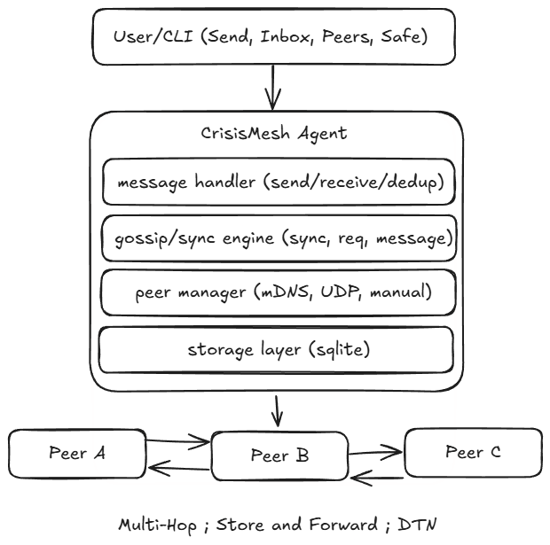

# CrisisMesh

[Read the Technical Whitepaper](https://github.com/bit2swaz/crisismesh/wiki/Main-Product-Wiki)

**Decentralized Offline Emergency Communication Network**



CrisisMesh is a battle-tested, decentralized mesh communication system designed for disaster response, emergency coordination, and offline scenarios. Built with Go, it provides **two distinct interfaces**: a Terminal UI (TUI) for commanders and coordinators, and a mobile-first Web UI for field workers and civilians—all operating without internet connectivity.

---

## 📋 Table of Contents

- [Overview](#-overview)
- [Key Features](#-key-features)
- [Architecture](#-architecture)
- [Getting Started](#-getting-started)
- [Usage Guide](#-usage-guide)
  - [Commander View (TUI)](#commander-view-tui)
  - [Civilian View (Web UI)](#civilian-view-web-ui)
- [Emergency Protocol](#-emergency-protocol-sos)
- [Security & Encryption](#-security--encryption)
- [Testing & Examples](#-testing--examples)
- [Configuration](#-configuration)
- [Troubleshooting](#-troubleshooting)
- [Advanced Topics](#-advanced-topics)
- [Development](#-development)
- [License](#-license)

---

## Overview

CrisisMesh enables **offline, serverless communication** in scenarios where traditional infrastructure has failed. Devices form a self-organizing mesh over local Wi-Fi, hotspots, or Ethernet. Messages are delivered using a **store-and-forward** approach inspired by Delay Tolerant Networking (DTN), ensuring eventual delivery even when sender and recipient are never online simultaneously.

### Use Cases

- **Disaster Response**: Coordinate rescue teams after earthquakes, floods, or hurricanes
- **Emergency Services**: Medical teams communicating in areas with infrastructure damage
- **Remote Operations**: Military or exploration teams in off-grid environments
- **Community Networks**: Grassroots communication during internet shutdowns
- **Field Research**: Scientists collaborating in remote locations

### Design Philosophy

1. **Offline-First**: Works completely disconnected from the internet
2. **Zero Configuration**: Auto-discovery via UDP broadcasts, no manual setup
3. **Dual Interface**: TUI for monitoring/coordination, Web UI for mobile/field use
4. **Store-and-Forward**: Messages persist until delivered, resilient to network partitions
5. **Security-Aware**: End-to-end encryption for direct messages using NaCl

---

## Key Features

### Core Networking
- **Automatic Peer Discovery**: UDP broadcast heartbeats (1-second interval)
- **Full Mesh Topology**: Each node connects to all discovered peers via TCP
- **Gossip Protocol**: Message inventory sync every 5 seconds (SYNC/REQ packets)
- **Auto-Reconnect**: Automatic TCP reconnection when stale peers reappear
- **Store-and-Forward**: Messages queued locally until recipient comes online

### User Interfaces

#### Commander View (TUI)
- **Split-Screen Layout**: 70% message stream + 30% peer monitor
- **Real-Time Monitoring**: Live peer table with connection status
- **Visual Alerts**: Pulsing red border for emergency SOS messages
- **Keyboard Shortcuts**: 
  - `Q`: Show QR code for mobile onboarding
  - `M`: Toggle monitor mode (JSON logs)
  - `Ctrl+S`: Broadcast "SAFE ALERT: I am safe!"
  - `?`: Help overlay
- **Read-Only**: Focus on monitoring and awareness (v0.2.0 will add input)

#### Civilian View (Web UI)
- **Mobile-First Design**: Chat bubble interface optimized for phones
- **SOS Button**: Red circular button with GPS acquisition
- **Network Visualization**: Force-directed graph showing mesh topology
- **Identity Management**: localStorage-based identity (no accounts)
- **Polling Updates**: 1-second refresh for new messages
- **Responsive**: Works on smartphones, tablets, and desktops

### Emergency Features
- **Priority System**: Normal (Priority 1) vs Emergency (Priority 2)
- **SOS Detection**: Auto-detects "SOS" keyword → Priority 2
- **GPS Integration**: Browser Geolocation API with Tokyo fallback
- **Visual Alerts**: Pulsing red borders, alert styling
- **Cloud Uplink**: Optional Discord webhook relay for SOS messages

### Security & Privacy
- **End-to-End Encryption**: NaCl sealed box (XSalsa20-Poly1305 + Curve25519)
- **Direct Messages**: `/dm <nickname> <message>` command
- **Identity System**: Per-node UUID + keypair in JSON file
- **Message Deduplication**: SHA256-based message IDs prevent loops
- **No Central Authority**: Fully decentralized, no single point of failure

### Data Persistence
- **SQLite Database**: WAL mode for concurrent access
- **GORM ORM**: Clean database abstraction layer
- **Message History**: All sent/received messages with metadata
- **Peer Records**: Discovered peers with last-seen timestamps
- **GPS Coordinates**: Stored with Priority 2 messages

---

## Architecture

### System Components

```
┌─────────────────────────────────────────────────────────────┐
│                         CrisisMesh Node                      │
├─────────────────────────────────────────────────────────────┤
│                                                               │
│  ┌──────────────┐          ┌──────────────┐                │
│  │ Commander UI │          │ Civilian UI  │                │
│  │    (TUI)     │          │   (Web UI)   │                │
│  │ Bubble Tea   │          │  HTTP + JS   │                │
│  └──────┬───────┘          └──────┬───────┘                │
│         │                          │                         │
│         └──────────┬───────────────┘                         │
│                    │                                         │
│         ┌──────────▼──────────┐                             │
│         │   Gossip Engine     │                             │
│         │  (Message Routing)  │                             │
│         └──────────┬──────────┘                             │
│                    │                                         │
│    ┌───────────────┼───────────────┐                        │
│    │               │               │                        │
│ ┌──▼────┐    ┌─────▼─────┐   ┌───▼────┐                   │
│ │ UDP   │    │    TCP    │   │ SQLite │                   │
│ │ Disco │    │  Mesh     │   │   DB   │                   │
│ │ very  │    │ Transport │   │  (WAL) │                   │
│ └───────┘    └───────────┘   └────────┘                   │
│                                                               │
└─────────────────────────────────────────────────────────────┘
         │                 │                    │
         │ Heartbeat       │ MSG/SYNC/REQ       │ Optional
         │ (1s)            │ (TCP Mesh)         │ Uplink
         ▼                 ▼                    ▼
    255.255.255.255    Peer Nodes         Discord Webhook
```

### Protocol Stack

#### Discovery Layer (UDP)
- **Broadcast**: 255.255.255.255 on configured port
- **Frequency**: 1 heartbeat per second
- **Payload**: JSON with node ID, nickname, port, public key, timestamp

#### Transport Layer (TCP)
- **Framing**: 4-byte big-endian length prefix + JSON payload
- **Max Payload**: 10MB (prevents memory exhaustion)
- **Packets**: MSG (messages), SYNC (inventory), REQ (requests)

#### Application Layer
- **Gossip Protocol**: Epidemic-style message propagation
- **Message ID**: 16-char hex (first 64 bits of SHA256)
- **TTL**: 10 hops maximum before discard
- **Deduplication**: Database-backed message ID tracking

### Data Flow

```
User Input (TUI/Web) 
  → Gossip Engine (PublishText)
    → SQLite (SaveMessage)
      → TCP Broadcast (to all peers)
        → Peer Gossip Engines
          → Peer Databases
            → Peer UIs
```

---

## Getting Started

### Prerequisites

- **Go**: 1.24 or higher
- **GCC**: Required for SQLite CGO compilation
- **OS**: Linux, macOS, or Windows (via WSL2)

### Installation

```bash
# Clone the repository
git clone https://github.com/bit2swaz/crisismesh.git
cd crisismesh

# Download dependencies
go mod download

# Build the binary
go build -o crisis ./cmd/crisis

# Verify build
./crisis --help
```

### Quick Start (Single Node)

```bash
# Start with TUI (Commander View)
./crisis start --nick COMMAND --port 9000

# The TUI will open immediately
# Web UI available at http://localhost:10000 (port + 1000)
```

### Quick Start (Multi-Node on Same Machine)

```bash
# Terminal 1: Alice (Commander)
./crisis start --nick ALICE --port 9000

# Terminal 2: Bob (Field Agent)
./crisis start --nick BOB --port 9001

# Terminal 3: Charlie (Civilian)
./crisis start --nick CHARLIE --port 9002

# They will discover each other within 2 seconds
# Web UIs: http://localhost:10000, 10001, 10002
```

### Quick Start (Mobile Device Setup)

```bash
# 1. Start node on laptop with Wi-Fi hotspot enabled
./crisis start --nick GATEWAY --port 9000

# 2. Press 'Q' in TUI to show QR code
# 3. Scan QR code with mobile phone camera
# 4. Phone browser opens Web UI automatically
# 5. Enter identity (e.g., "FIELD01")
# 6. Start messaging!
```

---

## Usage Guide

### Commander View (TUI)

The Terminal UI is designed for **coordinators and command centers** who need to monitor all activity, track peers, and maintain situational awareness.

#### Screen Layout

```
╔══════════════════════════════════════════════════════════════════╗
║  CrisisMesh v0.1.2  │  Node: abc123  │  Peers: 3  │  Uptime: 5m ║
╠════════════════════════════════════╦═════════════════════════════╣
║                                    ║  CONNECTED PEERS            ║
║  MESSAGE STREAM (70%)              ║  ┌──────────────────────┐  ║
║  ┌──────────────────────────────┐ ║  │ ALICE | 192.168.1.10 │  ║
║  │ [10:30] ALICE → All          │ ║  │ BOB   | 192.168.1.11 │  ║
║  │ Hello mesh                   │ ║  │ CAROL | 192.168.1.12 │  ║
║  │                               │ ║  └──────────────────────┘  ║
║  │ [10:31] BOB → All [ENC]      │ ║                             ║
║  │ Testing encryption           │ ║  Last Heartbeat:            ║
║  │                               │ ║  ALICE: 1s ago              ║
║  │ [10:32] CAROL → All [P2]     │ ║  BOB:   2s ago              ║
║  │ PRIORITY ALERT: SOS          │ ║  CAROL: 1s ago              ║
║  │ [GPS: 35.6895, 139.6917]     │ ║                             ║
║  │ ◀── RED BORDER PULSING       │ ║  Mesh Status: HEALTHY       ║
║  └──────────────────────────────┘ ║  Messages: 127 total        ║
║                                    ║  Storage: 2.3 MB            ║
╠════════════════════════════════════╩═════════════════════════════╣
║  Status: ONLINE │ Latency: 45ms │ Press ? for help              ║
╚══════════════════════════════════════════════════════════════════╝
```

#### Keyboard Shortcuts

| Key | Action |
|-----|--------|
| `Q` | Toggle fullscreen QR code (for mobile onboarding) |
| `M` | Toggle monitor mode (compact JSON log format) |
| `Ctrl+S` | Broadcast "SAFE ALERT: I am safe!" (Priority 2) |
| `?` | Toggle help overlay |
| `Ctrl+C` | Exit application |

#### Message Display Format

```
[HH:MM] NICKNAME → All/DM [FLAGS]
Message content here
[GPS: lat, long] (if Priority 2)

FLAGS:
  [ENC]  = Encrypted direct message
  [P2]   = Priority 2 (emergency)
  [HOP:N] = Multi-hop (N hops traversed)
```

#### Visual Alerts

- **Pulsing Red Border**: Full-screen border alternates between bright red (#FF0000) and dark red (#550000) every 500ms when Priority 2 message received
- **Yellow GPS Tags**: GPS coordinates displayed in yellow text
- **Red "NO SIGNAL"**: Displayed when Priority 2 but no GPS coordinates

### Civilian View (Web UI)

The Web UI is designed for **field workers, volunteers, and civilians** who need simple, mobile-friendly messaging capabilities.

#### Interface Elements

```
┌─────────────────────────────────────┐
│  CrisisMesh          [≡] [SOS]     │  ← Header (fixed)
├─────────────────────────────────────┤
│                                     │
│  ┌────────────────────┐            │
│  │ Alice: Hello!      │  10:30     │  ← Chat bubbles
│  └────────────────────┘            │
│                                     │
│            ┌────────────────────┐  │
│     10:31  │ Testing 123       │  │  ← Your messages
│            │ You               │  │
│            └────────────────────┘  │
│                                     │
│  ┌────────────────────┐            │
│  │ ⚠️ PRIORITY ALERT   │  10:32    │  ← SOS message
│  │ Bob: SOS           │            │
│  │ 📍 35.6895, 139.69 │            │
│  └────────────────────┘            │
│                                     │
├─────────────────────────────────────┤
│  [Type message...]         [Send]  │  ← Input (fixed)
└─────────────────────────────────────┘
```

#### Pages

1. **Messages** (`/` or `/messages.html`)
   - Chat interface with message bubbles
   - Scroll to view history
   - Send broadcasts and DMs
   - Red SOS button (top-right)

2. **Network** (`/network.html`)
   - Force-directed graph visualization
   - Green nodes = active peers
   - Gray nodes = stale peers
   - "ME" node highlighted

3. **Settings** (`/settings.html`)
   - View/change identity
   - Network status
   - Clear localStorage

#### SOS Button

The prominent red circular button in the top-right corner triggers emergency broadcasts:

1. Click SOS button
2. Confirm dialog appears
3. Browser requests GPS permission
4. GPS acquired (5-second timeout)
5. Sends "PRIORITY ALERT: SOS" with coordinates
6. All commanders see pulsing red border
7. Optional: Discord webhook relays to cloud

---

## Emergency Protocol (SOS)

### Triggering SOS Messages

| Method | Interface | Content | GPS |
|--------|-----------|---------|-----|
| Red SOS button | Web UI | "PRIORITY ALERT: SOS" | Auto-acquired |
| Type "SOS" | Web UI | "PRIORITY ALERT: SOS" | If available |
| `Ctrl+S` hotkey | TUI | "SAFE ALERT: I am safe!" | Display only |

### Auto-Detection

CrisisMesh automatically detects the keyword "SOS" (case-insensitive) and upgrades to Priority 2:

```go
// Automatic priority upgrade
if strings.ToUpper(content) == "SOS" {
    priority = 2
    content = "PRIORITY ALERT: SOS"
}
```

### GPS Acquisition (Web UI)

**Primary Method:**
- Browser Geolocation API (`navigator.geolocation.getCurrentPosition`)
- High accuracy mode enabled
- 5-second timeout
- Maximum age: 0 (force fresh fix)

**Fallback (Simulation):**
- Base coordinates: Tokyo Station (35.689487, 139.691706)
- Random jitter: ±0.001° (~110 meters)
- Used when: Permission denied, timeout, or API unavailable

### Cloud Uplink (Optional)

If `--discord-webhook` flag provided, Priority 2 messages are automatically relayed to Discord:

```bash
./crisis start --nick COMMAND --port 9000 \
  --discord-webhook https://discord.com/api/webhooks/123/abc
```

**Discord Message Format:**
```
📡 **[MESH RELAY]**
**User:** ALICE
**Message:** PRIORITY ALERT: SOS
**Location:** 35.6895, 139.6917
[Open in Maps](https://maps.google.com/?q=35.6895,139.6917)
```

**Uplink Behavior:**
- Non-blocking: Uses buffered channel (size 100)
- Filters: Only Priority 2 OR messages starting with `/uplink`
- Async: Runs in separate goroutine, never blocks mesh
- Confirmation: Stdout prints "[UPLINK] Relayed to Cloud"

---

## Security & Encryption

### Direct Message Encryption

**Command Syntax:**
```
/dm <nickname> <message>
```

**Example:**
```
/dm ALICE Meet at extraction point B
```

**Encryption Process:**
1. Lookup recipient's public key in peers table
2. Encrypt plaintext with NaCl sealed box
3. Store plaintext locally (sender can read own messages)
4. Broadcast hex-encoded ciphertext over mesh
5. Recipient automatically decrypts with private key
6. Recipient stores decrypted plaintext

**Algorithm:**
- **Cipher**: XSalsa20-Poly1305 (authenticated encryption)
- **Key Exchange**: Curve25519 ECDH
- **Mode**: Anonymous sealed box (only recipient's public key needed)
- **Key Size**: 32 bytes (256 bits)

### Identity Management

Each node has a unique identity stored in JSON:

```json
{
  "node_id": "550e8400-e29b-41d4-a716-446655440000",
  "nickname": "ALICE",
  "private_key": "hex-encoded 32-byte NaCl key",
  "public_key": "hex-encoded 32-byte NaCl key"
}
```

**Files:**
- `identity.json` - Default identity (auto-created)
- `identity_9000.json` - Port-specific (for multi-node testing)

**Key Generation:**
- Curve25519 keypair generated on first run
- Private key NEVER leaves the local machine
- Public key broadcast in UDP heartbeats
- Loss of private key = loss of ability to decrypt old DMs

### Security Limitations

**Current (v0.1.2):**
- ❌ Broadcast messages are **NOT encrypted** (plaintext on network)
- ❌ No message signing (authenticity not verified)
- ❌ No peer authentication (trust-on-first-use)
- ✅ Direct messages use E2E encryption
- ✅ Message replay prevented (timestamp in message ID)

**Planned (v0.3.0):**
- Ed25519 message signing for broadcast authenticity
- Group key exchange for encrypted broadcasts
- Peer reputation system (Sybil resistance)

---

## 🧪 Testing & Examples

### Test 1: Basic Two-Node Mesh

```bash
# Terminal 1
./crisis start --nick ALICE --port 9000

# Terminal 2
./crisis start --nick BOB --port 9001

# Expected: Both TUIs show each other in peer table within 2 seconds
```

### Test 2: Store-and-Forward (DTN)

```bash
# Terminal 1: Alice
./crisis start --nick ALICE --port 9000

# Terminal 2: Bob (start, then STOP)
./crisis start --nick BOB --port 9001
# Let them connect, then press Ctrl+C to stop Bob

# Terminal 3: Send message to Bob via Web UI
curl -X POST http://localhost:10000/api/messages \
  -H "Content-Type: application/json" \
  -d '{"content":"Hello Bob","author":"ALICE"}'

# Terminal 2: Restart Bob
./crisis start --nick BOB --port 9001

# Expected: Bob receives "Hello Bob" within 5 seconds (next gossip sync)
```

### Test 3: SOS with GPS

```bash
# Terminal 1: Start with Discord webhook
./crisis start --nick COMMAND --port 9000 \
  --discord-webhook https://discord.com/api/webhooks/YOUR_WEBHOOK

# Browser: Open http://localhost:10000
# 1. Enter identity (e.g., "FIELD01")
# 2. Click red SOS button
# 3. Confirm dialog
# 4. Allow GPS permission

# Expected in TUI:
# - Pulsing red border
# - Message: [USER: FIELD01] → PRIORITY ALERT: SOS [GPS: x.xxxx, y.yyyy]
# - Stdout: "[UPLINK] Relayed to Cloud"

# Expected in Discord:
# - Message with Google Maps link
```

### Test 4: Encrypted Direct Messages

```bash
# Terminal 1: Alice
./crisis start --nick ALICE --port 9000

# Terminal 2: Bob
./crisis start --nick BOB --port 9001

# Wait for peer discovery (2 seconds)

# Send encrypted DM via Web UI:
curl -X POST http://localhost:10000/api/messages \
  -H "Content-Type: application/json" \
  -d '{"content":"/dm BOB This is secret","author":"ALICE"}'

# Expected:
# - Alice's TUI: Shows plaintext (or encrypted if read-only)
# - Bob's TUI: Shows decrypted "[USER: ALICE] → This is secret"
# - Network: Hex-encoded ciphertext
```

### Test 5: Network Partition Healing

```bash
# Terminal 1: Alice
./crisis start --nick ALICE --port 9000

# Terminal 2: Bob
./crisis start --nick BOB --port 9001

# Terminal 3: Charlie
./crisis start --nick CHARLIE --port 9002

# All three connect, observe peer tables

# Kill Bob (Ctrl+C), wait 15 seconds
# Alice and Charlie mark Bob as stale

# Restart Bob
./crisis start --nick BOB --port 9001

# Expected:
# - Within 2 seconds: Bob reappears in Alice and Charlie's peer tables
# - Automatic SYNC triggered
# - Queued messages delivered
```

---

## Configuration

### CLI Flags

```bash
./crisis start [flags]

Required:
  --nick <string>         User nickname (e.g., "COMMAND", "ALPHA")

Optional:
  --port <int>            Mesh + discovery port (default: 9000)
  --web-port <int>        Web UI port (default: <port> + 1000)
  --discord-webhook <url> Discord webhook for SOS relay
```

### Examples

```bash
# Commander with default ports
./crisis start --nick COMMAND --port 9000
# Web UI at http://localhost:10000

# Custom web port
./crisis start --nick ALICE --port 9001 --web-port 8080
# Web UI at http://localhost:8080

# With Discord uplink
./crisis start --nick GATEWAY --port 9000 \
  --discord-webhook https://discord.com/api/webhooks/123/abc

# Headless mode (Web UI only, no TUI)
CRISIS_HEADLESS=true ./crisis start --nick SERVER --port 9000
```

### Environment Variables

```bash
CRISIS_HEADLESS=true    # Disable TUI, run Web UI only
DEBUG=true              # Enable verbose debug logging
```

### File Locations

```
.
├── crisis                # Binary
├── identity.json         # Default identity
├── identity_9000.json    # Per-port identities
├── identity_9001.json
├── crisis.db             # Default database
├── crisis_9000.db        # Per-port databases
└── crisis_9001.db
```

### Port Allocation

**Default Behavior:**
- Gossip port: 9000 (TCP + UDP)
- Web port: 10000 (gossip port + 1000)

**Multi-Node Testing:**
```bash
# Automatic web port calculation
./crisis --port 9000  # Web: 10000
./crisis --port 9001  # Web: 10001
./crisis --port 9002  # Web: 10002
```

### Database Schema

**Messages Table:**
- `id` - 16-char hex message ID
- `sender_id` - Node UUID
- `recipient_id` - Target UUID (empty = broadcast)
- `content` - Plaintext or ciphertext
- `priority` - 1 (normal) or 2 (SOS)
- `author` - Human-readable nickname
- `lat`, `long` - GPS coordinates
- `timestamp` - Unix seconds
- `ttl` - Remaining hops
- `hop_count` - Hops traversed
- `status` - "sent", "delivered", "failed"
- `is_encrypted` - Boolean flag

**Peers Table:**
- `id` - Node UUID
- `nickname` - Display name
- `public_key` - Hex-encoded NaCl key
- `last_seen` - Timestamp
- `port` - TCP listening port

---

## Troubleshooting

### Peers Not Discovering

**Symptom:** TUI peer table shows 0 peers

**Solutions:**
1. Check firewall: Allow UDP broadcast on configured port
2. Verify subnet: Nodes must be on same LAN (192.168.x.x)
3. Check logs: Look for "Heartbeat sent" messages
4. Test manually: `/connect <ip>:<port>` (not yet exposed in TUI)

### Messages Not Delivering

**Symptom:** Sent messages don't appear on recipient

**Solutions:**
1. Check peer table: Recipient must be in "Peers" list
2. Wait for sync: Gossip syncs every 5 seconds
3. Check TTL: Messages expire after 10 hops
4. Verify database: `sqlite3 crisis.db "SELECT * FROM messages;"`

### GPS Not Working

**Symptom:** SOS shows "NO SIGNAL" or Tokyo coordinates

**Solutions:**
1. Use HTTPS: Geolocation API requires HTTPS or localhost
2. Allow permission: Browser must have location permission
3. Wait longer: GPS acquisition can take 5+ seconds outdoors
4. Fallback is normal: Tokyo coordinates indicate GPS timeout (not an error)

### Web UI Not Loading

**Symptom:** Browser shows "Cannot connect"

**Solutions:**
1. Check port: Default is `<port> + 1000` (e.g., 9000 → 10000)
2. Check firewall: Allow HTTP on web port
3. Try localhost: Use `http://localhost:10000` not `127.0.0.1`
4. Check logs: Look for "HTTP server started on :10000"

### TUI Rendering Issues

**Symptom:** Garbled text, broken borders

**Solutions:**
1. Update terminal: Use modern terminal (iTerm2, Windows Terminal, etc.)
2. Set TERM: `export TERM=xterm-256color`
3. Increase size: TUI requires minimum 80x24 characters
4. Check font: Use monospace font with good Unicode support

---

## Advanced Topics

### Message ID Algorithm

```go
func generateMessageID(senderID, content string, timestamp int64) string {
    h := sha256.New()
    h.Write([]byte(senderID))
    h.Write([]byte(content))
    h.Write([]byte(fmt.Sprintf("%d", timestamp)))
    return hex.EncodeToString(h.Sum(nil))[:16] // First 16 hex chars
}
```

**Properties:**
- Deterministic: Same inputs = same ID
- Unique: Different sender/content/time = different ID
- Collision-resistant: ~2^-64 probability
- Prevents replay: Timestamp ensures uniqueness

### Gossip Protocol

**SYNC Phase (every 5 seconds):**
1. Node A sends list of all message IDs to Node B
2. Node B compares against local database
3. Node B identifies missing IDs

**REQ Phase:**
1. Node B sends list of missing IDs to Node A
2. Node A looks up full messages for those IDs
3. Node A sends MSG packets with full payloads

**Result:** Eventually consistent message history across all nodes

### TCP Framing

```
┌────────────────────────┐
│ Length (4 bytes)       │  Big-endian uint32
├────────────────────────┤
│ Payload (N bytes)      │  JSON-encoded packet
└────────────────────────┘

Max payload: 10MB (prevents DoS)
```

### Packet Types

1. **MSG**: Full message with metadata
2. **SYNC**: Array of message IDs
3. **REQ**: Array of requested message IDs

### Network Topology

```
Full Mesh (N nodes):
- Connections: N * (N-1) / 2
- Example: 5 nodes = 10 connections
- Scales poorly beyond 20-30 nodes
```

**Future:** Implement smart routing (OLSR, BATMAN) for larger networks

---

## Development

### Project Structure

```
crisismesh/
├── cmd/
│   └── crisis/
│       ├── main.go          # Entry point
│       └── root.go          # Cobra CLI setup
├── internal/
│   ├── config/
│   │   └── config.go        # Config structs
│   ├── core/
│   │   └── identity.go      # Keypair + UUID generation
│   ├── discovery/
│   │   └── heartbeat.go     # UDP broadcast
│   ├── engine/
│   │   ├── gossip.go        # Message routing
│   │   └── handlers.go      # Packet handlers
│   ├── logger/
│   │   └── logger.go        # Structured logging
│   ├── protocol/
│   │   └── types.go         # Packet definitions
│   ├── store/
│   │   ├── db.go            # Database layer
│   │   └── models.go        # GORM models
│   ├── transport/
│   │   ├── framing.go       # TCP framing
│   │   └── manager.go       # Connection pool
│   └── tui/
│       ├── model.go         # Bubble Tea model
│       └── view.go          # Rendering
├── static/                  # Web UI files
├── go.mod
└── README.md
```

### Building

```bash
# Standard build
go build -o crisis ./cmd/crisis

# With race detector
go build -race -o crisis ./cmd/crisis

# Optimized for size
go build -ldflags="-s -w" -o crisis ./cmd/crisis

# Cross-compile for Raspberry Pi
GOOS=linux GOARCH=arm64 go build -o crisis-arm64 ./cmd/crisis
```

### Testing

```bash
# Run unit tests
go test ./...

# Run with coverage
go test -cover ./...

# Specific package
go test ./internal/store/

# Verbose output
go test -v ./internal/engine/
```

### Dependencies

```
github.com/charmbracelet/bubbletea  # TUI framework
github.com/charmbracelet/lipgloss   # TUI styling
github.com/google/uuid              # UUID generation
github.com/spf13/cobra              # CLI framework
golang.org/x/crypto/nacl/box        # NaCl encryption
gorm.io/gorm                        # ORM
gorm.io/driver/sqlite               # SQLite driver
```

---

## License

MIT License - see LICENSE file for details

---

## Contributing

Contributions welcome! Please see `PRD_v0.1.2.md` for detailed technical specifications.

**Priority Areas:**
- TUI message input widget (v0.2.0)
- Broadcast message encryption
- Message signing (Ed25519)
- Mobile app (React Native / Flutter)
- LoRa radio support

---

## Resources

- **Documentation**: See `PRD_v0.1.2.md` for comprehensive technical documentation
- **Repository**: https://github.com/bit2swaz/crisismesh
- **Issues**: https://github.com/bit2swaz/crisismesh/issues

---

**Built with ❤️ for disaster response and emergency communication**
